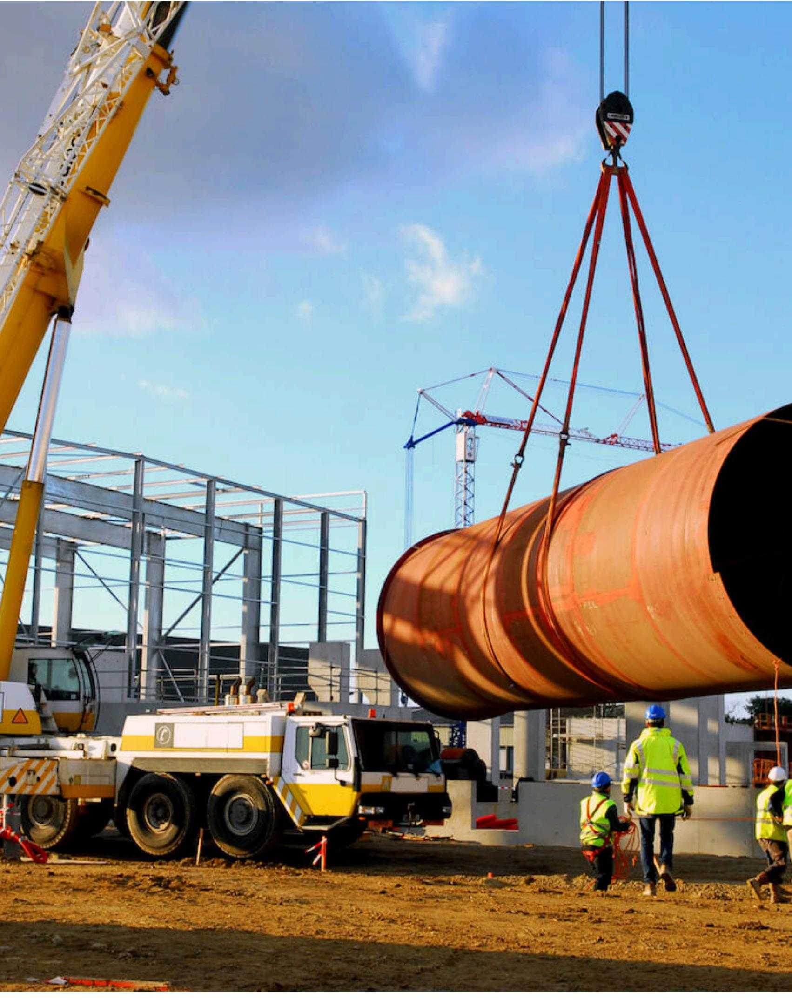

# LIVRE DIGITAL LEVAGE

# Introduction

Bienvenue dans ce e-book consacré aux opérations de levage chez TotalEnergies. Le levage joue un rôle crucial dans nos activités quotidiennes, qu'il s'agisse de soulever, descendre ou suspendre des charges de différentes tailles et masses. Bien que courantes, ces opérations présentent des risques importants pour le personnel, l'environnement et les installations.

Il est essentiel de disposer de la formation et des compétences nécessaires pour effectuer ces opérations en toute sécurité. Cette norme d'élingage et de levage doit être respectée.

Ce guide vise à fournir un aperçu des meilleures pratiques, des procédures et des normes en vigueur pour les opérations de levage au sein de notre entreprise.

N’oubliez pas: S’il n’y a aucun CMU, aucunet/ou aucun CODE COULEUR, ne l’utilisez p ${ \mathsf { n } } ^ { \circ }$ d’identification!

# La Sécurité est une valeur de la Compagnie. Elle est la pierre angulaire de notre excellence opérationnelle dans chacun de nos métiers.

Tous, collaborateurs de TotalEnergies et des entreprises partenaires, engageons-nous, personnellement et collectivement, pour assurer la sécurité au quotidien dans nos opérations et sur nos sites avec un objectif commun : \* Zéro accident mortel .

Nos Regles d'or, établies à partir de retours d'expérience, sont essentielles pour atteindre notre ambition en matiere de sécurité. C'est en nous les appropriant, en les mettant en oeuvre et en faisant preuve d'une vigilance de tous les instants, pour nous-mèmes et pour nos collegues, qu'elles rempliront leur role et deviendront un réflexe.

Tous les accidents sont évitables, j'en ai la conviction!

L'engagement de chacun d'entre nous a faire des Règles d'or un mode d'action systématique, partout, tous les jours, s'inscrit pleinement dans I'ambition de Ia Compagnie : mettre le développement durable au coeur de notre stratégie, de nos projets et de nos opérations.

# Michel Charton Directeur HSE

#

Pour travailler en sécurité et protéger la vie de tous :

Approprions-nous et mettons en oeuvre systématiquement nos Règles d'or.

Intervenons en cas d'écarts constatés avec nos règles de sécurité.

Signalons les écarts pour en tirer des enseignements.

Partageons les bonnes pratiques de mise en oeuvre.

#

1 | situations à risques

7 | Systèmes alimentés en énergie

2 I Circulation

8 | Espaces confines

3 | Gestes, postures, outillages

9 I Travaux de fouille

4IEquipements de protection individuelle

10 I Travaux en hauteur

5 I Permis de travail

11 | Travail à chaud

6 | Opérations de levage

12 | Ligne de danger

#

#

Je ne fume ou ne vapote pas en dehors des zones autorisées.

Je ne travaille et ne conduis pas sous lemprise de Ialcool ou de drogues.

Je securise la situation dégradée et la signale à mon superviseur.

Je connais les risques avant d'effectuer une opération peu fréquente ou complexe.

Je respecte les modes opératoires d'arrèt et de démarrage des équipements et installations.

#

#

Je controle létat de mon véhicule avant utilisation.

J'attache toujours ma ceinture de sécurité.

Je respecte la limitation de vitesse et j'adapte ma conduite aux conditions de la route.

Je n'utilise aucun systeme de communication en conduisant, tel que téléphone, talkie-walkie et radio, méme avec un kit mains libres.

Je respecte les temps de conduite autorisés et le plan de gestion du déplacement.

J'emprunte les voies dédiées aux piétons et les pistes cyclables.

Je tiens la rampe dans les escaliers.

Gestes, postures, outillages

Je manipule les outils en sécurité.

#

Je vérifie que mon outil est :

celui mentionné dans le permis de travail ou le mode opératoire;   
• adapté à la tache et à la zone d'utilisation ;   
• en bon état.

J'utilise les outils, y compris les accessoires d'épreuves ou de tests, conformément aux limites fixées par le fabricant.

Je positionne mon corps pour minimiser les efforts excessifs.

# Équipements de protection individuelle (EPI)

Je porte les EPI requis.

Mon engagement sécurité

Je vérifie le bon état de mes EPI avant utilisation.

Je porte mon casque avec la jugulaire attachée.

Je porte les EPI adaptés à la tache et la zone dans laquelle je travaille.

Je porte un gilet de sauvetage lorsque cela est requis.

# Permis de travail

Je travaille avec un permis valide.

#

J'ai vérifié les permis et certificats requis.

Je suis habilité(e) et autorisé(e) à réaliser le travail.

Je comprends le permis de travail.

Je m'assure de lidentification du point d'intervention.

J'ai vérifié que les conditions de sécurité sont réunies pour commencer le travail.

Je m'arrete, réévalue les risques si les circonstances changent et j'en réfère à mon superviseur.

# Opérations de levage

Je respecte le dossier de levage.

Mon engagement sécurité

Jinstalle les barrières et périmètres de sécurité.

Je verifie que les équipements de levage ont été inspectés, sont en bon état et sont appropriés.

J'utilise uniquement des équipements pour lesquels je suis habilité(e).

Je vérifie que la charge est bien élinguée et colisée et je controle la charge en mouvement.

Je m'assure de la présence d'un chef de manoeuvre habilité pour l'opération de levage.

Je ne me place jamais sous une charge suspendue.

# Systèmes alimentés en énergie

Je vérifie lisolation et I'absence d'énergie et de fluides avant toute intervention.

# Mon engagement sécurité

Je dispose d'un permis de travail et d'un certificat de consignation des systèmes alimentés en énergie.

J'ai identifié toutes les sources d'énergie et de fluides.

Je respecte le schéma d'isolement.

Je confirme que les sources d'énergie et de fluides ont été isolées, verrouillées et signalisées.

Je m'assure de I'absence d'alimentation en énergie et fluides.

Je m'assure de I'absence d'énergie et de fluides residuels ou accumulés.

Je m'assure de la fin des travaux et je vérifie la dépose des isolements avant redémarrage.

# Espaces confinés

J'obtiens l'autorisation avant d'entrer dans un espace confiné.

Mon engagement sécurité

Je dispose d'un permis de travail et d'un certificat de pénétration en espace confiné.

Je m'assure que toutes les sources d'énergie et de fluides sont isolées.

Je vérifie et jutilise un appareil de protection respiratoire lorsqu'il est requis.

Je confirme qu'un plan de secours est en place.

Je confirme que l'atmosphère a été testée avant intervention et qu'elle est controlée.

Je confirme qu'il y a une supervision pour les entrees/sorties et pour donner I'alerte.

Je recois I'autorisation d'entrer.

# Travaux de fouille

Je sécurise les zones de fouille.

# Mon engagement sécurité :

Je dispose d'un permis de travail et d'un certificat de fouille.

Je confirme que la zone de fouille est bien balisée.

Je suis vigilant(e) quant au repérage des réseaux et ouvrages enterrés.

Je positionne les engins et la matiere extraite à plus d'un mètre de la fouille.

Je ne descends dans une fouille $\geq 1 . 5$ m que si laccès est sécurisé.

# Travaux en hauteur

Je me protège du risque de chute lors d'un travail en hauteur ≥ 1,5 m.

Mon engagement sécurité :

J'inspecte mon harnais, la longe et la ligne de vie avant usage.

Je sécurise les outils et matériaux pour prévenir les chutes d'objets.

Je porte un harnais et je m'attache aux points d'ancrage validés conformément au permis de travail.

J'utilise un echafaudage adapté au besoin et approuvé.

Je respecte la distance minimale de sécurité lors d'un travail à proximité des lignes électriques.

Je m'assure de la solidité des toits (bacs, batiments, auvents, etc.) avant tout travail et de l'installation de protections adaptées sur les zones fragiles.

Je déplace une plateforme élévatrice mobile de personnel (PEMP) uniquement en position basse.

# Travail â chaud

J'évite les travaux à chaud dans la mesure du possible.

# Mon engagement sécurité :

Je dispose d'un permis de travail a chaud.

J'identifie les substances inflammables et les sources d'ignition.

Avant d'entreprendre tout travail a chaud :

• je m'assure de I'absence de substances inflammables ou de leur isolation ;   
• je reçois I'autorisation écrite.

En zone dangereuse, je confirme que :

• Iabsence de gaz a été testée ;   
• I'absence de gaz sera contròlée en permanence.

# Regle12

# Ligne de danger

#

Je me positionne de façon à éviter :

• les objets en mouvement ; • les engins et véhicules ; • les décharges de pression • les chutes d'objets.

J'installe les barrières et périmètres de sécurité.

Je prends les mesures nécessaires pour sécuriser les objets non fixés.

Je respecte les barrières et périmètres de sécurité.

#

Nous avons le devoir d'intervenir des qu'une situation nous parait dangereuse, et notamment lorsque les Règles d'or ne sont pas mises en ceuvre.

Mème en cas de doute, sans craindre de s'exposer à une sanction, utilisons notre Stop Card!

En posant des questions sur la sécurité d'une activité et en demandant 'arret d'un travail en cours, nous pouvons éviter des accidents et sauver des vies.

STOP CARD

J'interviens si une situation me parait dangereuse !

# Sommaire

# Introduction et champs d’applications

1.0 Glossaire   
2.0 Définitions et principes des équipements de levage   
3.0 Inspection d’appareils de levage   
4.0 Sélection d’un équipement de levage   
5.0 Améliorer la sécurité des opérations de levage   
6.0 Norme et formulaire de contrôle et de récupération

# Utilisation sécuritaire du matériel

7.0 Grues   
8.0 Palans à chaînes   
9.0 Palans à câble (Tirfors)   
10.0 Poulies à chape ouverte / Moufles   
11.0 Treuils   
12.0 Elingues à câbles métalliques

# Conseil de sécurité

13.0 Elingues en fibre synthétiques   
14.0 Manilles   
15.0 Boulons à oeil   
16.0 Tendeurs   
17.0 Dispositifs anti-chute   
18.0 Recommandations concernant l’élingage   
19.0 Chargement/ Déchargement de conteneurs   
20.0 Transfert de personnel   
21.0 Levage au dessus d’équipements sous tension   
22.0 Levage sans contact avec les mains

# Tableaux de charges utiles

Tableaux 1 Charges de rupture des câbles métalliques   
Tableaux 2 Elingues en câbles métalliques   
Tableaux 3 Elingues en fibres synthétiques   
Tableaux 4 Elingues en chaîne alliage   
Tableau 5 Manilles en alliage   
Tableau 6 Boulon à œil   
Tableau 7 Anneaux de levage   
Tableau 8 Tendeurs

Annexes

Annexe 1 Equipements de levage / Matrice législative

Annexe 2 Densité des matériaux

Annexe 3 Liste de contrôle générale avant levage

Annexe 4 Echelle de Beaufort des forces du vent et indicateurs visuels

Annexe 5 Calculs utiles

# 1.0 Glossaire

# 1.1 Personne compétente

Personne dont les connaissances, l'expérience et les compétences, ainsi que la formation et l'autorisation de travail à un poste de levage défini ont été avérées.

# 1.2 Charge utile (en anglais Working Load Limit WLL)

La charge maximale qu'un appareil de levage est conçu pour lever, abaisser ou suspendre. Cette charge maximale ne tient pas compte des conditions de service particulières qui peuvent modifier la capacité finale de l'équipement (voir CMU ci-dessous).

Remarque: la charge utile déterminée par la personne compétente ne doit jamais être dépassée volontairement.

# Charge maximale utile (CMU) (en anglais Safe Working Load SWL)1.3

La charge maximale (telle que certifiée par une personne compétente) qu'un appareil de levage est capable de lever, d'abaisser ou de tenir suspendue dans des conditions de service particulières. La CMU peut donc être inférieure à la charge utile.

Remarque: la charge maximale utile déterminée par la personne compétente ne doit jamais être dépassée volontairement.

# 1.4 Facteur de sécurité

Rapport entre la charge qui provoquerait la défaillance d'un élément d'un appareil de levage et la charge qui lui est imposée en service (c.-à-d la CMU qui permet de tenir compte de critères négatifs tels qu'usure, charges dynamiques, etc.).

# 1.5 Code couleur

Méthode de marquage de l'équipement (normalement avec de la peinture) pour indiquer visuellement son statut en matière de certification.

# Numéro de l'installation/d'identification1.06

Numéro unique donné à un élément d'un appareil de levage à des fins d'enregistrement et pour en faciliter la traçabilité.

# 1.07 Hauteur libre

Distance verticale maximale entre l'élément à soulever et le point de suspension de l'appareil de levage, c.-a-d. entre les œils de levage et le dessous des poutres du chemin de roulement.

# 1.08 Hauteur de levage

Distance de déplacement possible entre les points de connexion supérieur et inférieur, c.-à-d. les crochets d'un appareil de levage.

# 1.09 Dimension établie

Distance minimum entre le niveau de suspension et la selle de crochet inférieure (aussi connu sous le nom de hauteur fermée).

# 1.10 Capteurs de charge

Élément d'équipement utilisé pour détecter les charges réelles à un point de fixation (p. ex. manille à capteur de charge, cale-étalon ou cellule dynamométrique en compression, etc.)

# 1.11 Charge d'épreuve

Charge appliquée en conditions d'essai supérieure à la CMU/CU afin de vérifier l'intégrité de l'équipement de levage.

# Personne compétente (pour l'inspection du matériel de levage)1.12

Individu ayant les connaissances et l'expérience requises, aussi bien théoriques que pratiques, sur le matériel et équipement considéré pour pouvoir certifier avec confiance que celui-ci ne présente pas de défaut évident et qu'il convient en tous points pour l'opération pour laquelle il sera utilisé.

# 2.0 Définition et principes des équipements de levage

# 2.1 Equipements de levage

Ces équipements comprennent les appareils et l’équipement de levage. Ils sont définis comme suit:

# Appareils de levage

Tout dispositif mécanique capable de lever ou d’abaisser une charge. Ex: Grues, Chariots élévateurs, Nacelles suspendues, Palans, Poutre de levage, Treuils...

# Equipement de levage

Tout dispositif quel qu’il soit, utilisé et conçu pour être utilisé directement ou indirectement pour relier une charge à un appareil de levage et ne faisant pas partie de la charge.

Ex: élingues à câble, chaîne ou fibre synthétique, crochets et accessoires, pivots, manilles, boulon à œil, ridoirs, attaches à coin, lève-tôles.

# 2.2 Compétent(e)

Disposant des connaissances, des compétences, ainsi que de l’expérience nécessaire à la réalisation de tâches spécifiques.

# 2.3 Abrasion

Usure de surfaces des brins d’un câble.

# 2.4 Homologué

Conforme à la norme intérieur de l’entreprise.

# 2.5 Chef de manœuvre

Individu clairement identifiable ayant la responsabilité partagée d’assurer un levage et une dépose de la charge en toute sécurité. Contrôle également l’opération de levage lors d’un levage en aveugle.

# 2.6 Levage en aveugle

Lorsque l’utilisateur de l’appareil de levage n’a pas le chef de manœuvre, responsable de la charge, dans son champ visuel de manière continue.

# Agent de coordination du levage 2.7

Point de contact responsable du levage pour une installation particulière et personne compétente pour les opérations de levage.

# Résistance à la rupture (câble)2.8

La charge mesurée requise pour briser un câble en tension.

# 2.9 CCU

Unités de transport de marchandises (Cargo Carrying Unit), tout équipement utilisé pour contenir ou transférer une charge. Exemples: conteneurs, nacelles, râteliers à bouteilles de gaz, nacelles de transfert de personnel, bennes à déchets, ect.

# 2.10  Certification

La preuve (généralement sous forme de document papier) que le matériel est certifié.

# 2.11 Certifié

Prouve la réussite à un examen défini.

# 2.12  Câble Lang

Câble dont les fils composant les torons et ces derniers sont dans le même sens

# 2.13  Câblage à gauche ordinaire

Les fils sont enroulés vers la droite et les torons vers la gauche

# 2.14  Plan de levage

Une fois l’évaluation des risques terminée, un document écrit officiel est crée afin de détailler l’approche à suivre lors de l’opération de levage. Elle identifiera le personnel et l’équipement requis, ainsi que la méthode de levage.

# 2.15  Essai en charge

Essai de traction à un niveau prédéterminé et nouvelle inspection d’un élément de l’équipement.

# 2.16  Câblage à droite ordinaire

Les fils sont enroulés vers la gauche et les torons vers la droite

# 2.17 Corde de manœuvre

Une corde de type “anti-nœuds” attachés à une charge suspendue (généralement en bas) facilite la stabilisation de cette dernière et permet au membre de l’équipage tenant la corde de prévenir toute rotation et d’aider au guidage de la charge.

# 2.18 Tirfor

Mot anglais décrivant un treuil manuel utilisé pour déplacer/lever des objets lourds par tranches ou pour dérouler le câble.

# 2.19 Qualifié(e)

Compétent(e), grâce à un enseignement et une pratique spécialisés. Une fois terminé, une formation (comprenant généralement des examens permettent de prouver sa compétence) est généralement suivie d’une certification.

# 2.20  Principes de l’équipement de levage

Tous les équipements de levage doivent avoir une solidité et une construction adéquates, être réalisés dans des matériaux de qualité et capables de supporter les charges et contraintes qu’ils auront à supporter. Ils devront être testés conformément aux exigences réglementaires (par application d’une charge d’épreuve) et u certificat d’essai sera émis avant leur première utilisation. Ce certificat est un document juridique important.

# 2.21  Facteurs de sécurité

Le facteur de sécurité pour tout équipement de levage doit être adéquat et basé sur sa conception. Il ne doit jamais être abaissé et sert à indiquer la tolérance à l'usure, aux impacts, aux charges dynamiques et aux surcharges accidentelles. Ces tolérances sont prévues uniquement pour des circonstances imprévues et ne doivent pas être réduites volontairement. Évitez les surcharges et soyez vigilants pour prévenir les situations accidentelles. En cas de doute, consultez votre superviseur.

2.22  Certains dispositifs de levage (p. ex. palonniers) peuvent être utilisés de différentes façons. Il est donc important que le fabricant/fournisseur donne dans chaque cas des renseignements sur l'usage spécifique prévu et demande conseil avant de tenter toute utilisation non prévue

2.23  Certains chapitres de cette norme mentionnent l'angle auquel l'équipement est utilisé (p. ex. l'angle entre les brins d'une élingue multiple). Il est extrêmement important de tenir compte de la variation de la charge maximale d'utilisation que peut entraîner l'utilisation d'un tel équipement à un angle prononcé

2.24  Un point final à considérer lors de la sélection de l'équipement pour une opération donnée est la compatibilité entre les différents éléments requis. Un certain nombre de qualités différentes de matériau(x) sont souvent utilisées pour le matériel de levage. En particulier, on remarquera que la taille des crochets, maillons, anneaux et manilles varie considérablement pour une capacité donnée selon le type de métal utilisé. Vous devrez donc vous assurer que chaque élément est correctement monté et aligné avec son voisin. Un anneau ou une manille intermédiaires pourront pour cela être utilisés en cas de besoin. 25

# 3.0 INSPECTION D'APPAREILS DE LEVAGE

Ce chapitre décrits les inspections nécessaires pour garantir la sécurité des opérations de levage.

# 3.1 Vérifications avant l'utilisation

Avant chaque utilisation, il est impératif d'examiner tous les composants de l'appareil de levage pour s'assurer qu'ils sont en bon état et sécurisés pour l'opération prévue.

Attention! Ne rangez pas le matériel de levage dans des vestiaires ou coffres à outils, car il pourrait être oublié lors d'une inspection et ainsi ne plus être certifié.

3.2 Trois éléments spécifiques à vérifier, en dehors de l'équipement, sont :

I) La CMU requise.   
II) Le ${ \mathsf { n } } ^ { \circ }$ de l'installation/d'identification.   
III) Le bon code couleur (le code courant doit être affiché à un endroit bien en vue - pour le confirmer, vous adresser à votre superviseur).

Remarque : Le code couleur n'indique pas l'aptitude à l'usage, mais simplement l'état de certification.

3.3 Pour plus de détails sur les points à vérifier lors de ces inspections, consultez le chapitre 6 "Améliorer la sécurité des opérations de levage" de cette norme, les détails variant selon le type d'équipement.

N'oubliez pas: S'il n'y a aucune CMU, aucun ${ \mathsf { n } } ^ { \circ }$ d'identification et/ ou aucun CODE COULEUR, ne l'utilisez pas !

# 3.4 Appareils de levage

Grues, chariots élévateurs, à fourche et autres, nacelles suspendues, palans motorisés, à main, à levier et à corde, chariots porte-palans et attaches de poutres, moufles, treuils, poutres de levage.

# 3.5 Equipement de levage

Elingues à câble, chaîne ou fibre synthétique, crochets et accessoires, pivots, manilles, boulons à oeil, tendeurs/ridois, attaches à coin, lèvetôles.

Consultez la section 2.0 de cette norme afin d’obtenir la bonne définition de cet équipement

# 4.0 SELECTION D’UN EQUIPEMENT DE LEVAGE

4.1

Avant de préparer le levage, il est crucial de déterminer le poids de la charge à soulever. Dans la plupart des cas, ce chiffre est déjà connu. Cependant, si ce n'est pas le cas, utilisez un dispositif de mesure du poids (voir exemples aux figures 4.1 à 5.3 ci-dessous). Vous pouvez également consulter le fabricant ou prendre des mesures et calculer le poids en utilisant le tableau de densité des matériaux à l'annexe 2. En cas de doute, n'hésitez pas à consulter votre agent de coordination du levage.

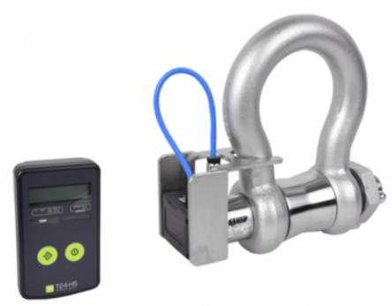  
Fig. 4.1 Manille de cellule dynamométrique

  
Fig. 4.2 Contrôleur d’état de charge de grue

  
Fig. 4.3 Dynamomètre

4.2 Après avoir déterminé le poids de la charge, il est essentiel de vérifier la hauteur libre disponible, car elle influence les angles des élingues et la tension réelle sur les brins.

Remarque: Le poids de l'élingage sélectionné doit être ajouté à celui de la charge, et le poids total doit être pris en compte lors du choix de l'appareil de levage.

4.3 Vérifiez la compatibilité des différents composants, car les tailles varient selon le matériau utilisé pour la fabrication.

4.4 Vérifiez bien que l'équipement retenu convient à la tâche spécifique et à son environnement, par exemple en cas d'utilisation sous l'eau (tous les types d'équipements ne conviennent pas pour une telle utilisation !).

4.5 Une fois l'équipement sélectionné, il doit subir un examen "pré- utilisation" comme décrit dans les différents chapitres de cette norme. Si un élément échoue à l'examen visuel, il doit être immédiatement mis hors service et signalé à un superviseur ou à l'agent de coordination du levage.

# 5.0 AMÉLIORER LA SÉCURITÉ DES OPÉRATIONS DE LEVAGE

Ce chapitre présente les procédures correctes à suivre lors d'une opération de levage.

# 5.1 Compétences du personnel

Toute personne utilisant un appareil ou équipement de levage doit être formée à son utilisation et posséder une expérience pratique de ses capacités et des défaillances potentielles. Ces connaissances sont également utiles lors de l'inspection avant utilisation.

# Ne jamais dépasser la charge maximale utile

2 Lors de toute opération de levage, il est impératif de s'assurer que la charge imposée à tout appareil de levage ou partie de celui-ci ne dépasse pas la CMU/CU. En cas de doute sur cette charge ou celle appliquée à un élément particulier de l'engin ou appareil de levage, il est recommandé d'utiliser des capteurs de charge. De plus, il est essentiel de veiller à ce que la charge reste stable à tous les stades de l'opération. En général, la charge pourrait être instable si son centre de gravité ne se trouve pas sous le crochet ou s'il est plus haut que le point de fixation des élingues à la charge. D'autres causes d'instabilité peuvent inclure un liquide s'agitant dans un récipient, etc.

# Utilisation correcte

5.3 L'équipement doit être utilisé uniquement pour l'usage spécifique pour lequel il a été conçu et ne doit pas être adapté à un autre type d'opération.

# 5.4 Vérification du levage

Avant toute opération de levage, la charge doit d'abord être soulevée à une faible hauteur. Ce levage d'essai permet au grutier ou opérateur de vérifier qu'il a correctement estimé l'équilibre, la stabilité et la sécurité générale de la charge alors que celle-ci est encore dans une position relativement sûre. La charge devra être descendue et l'élingage modifié en cas de découverte de différences. Cette séquence de levage d'essai puis d'ajustement doit être répétée jusqu'à ce que l'opérateur soit satisfait de l'équilibrage, de la stabilité de la charge et de la sécurité du levage.

Attention ! Ne vous tenez jamais sous une charge; gardez vos mains éloignées des élingues, etc. (conformément aux consignes de levage sans contact avec les mains § 28). Évitez de grimper sur les conteneurs et matériaux empilés; ne vous tenez jamais entre les charges et des murs ou parois de cales, etc.

# 5.5 Prévoyez

Avant de déplacer une charge, préparez son trajet jusqu'au point de dépose en enlevant toute obstruction et en s'assurant que le personnel a quitté la zone.

Attention! Ne jamais déplacer une charge au-dessus de personnel.

Si nécessaire, avertissez le personnel pour qu'il quitte la zone avant de déplacer la charge. Évitez également de déplacer la charge au-dessus de machines en fonctionnement ou d'équipements critiques.

Avant de lever une charge, assurez-vous que le point de repose est suffisamment grand et peut recevoir la charge en toute sécurité. Il pourrait être nécessaire de prévoir des cales spécifiques, comme des blocs de bois, pour permettre l'enlèvement des élingues de la charge. La charge ne doit jamais être abaissée de manière à pincer ou écraser les élingues, car cela pourrait les endommager gravement. Lorsque vous abaissez la charge, arrêtez-la à faible distance de la surface de dépose pour permettre au grutier de la stabiliser, de vérifier la position des cales au sol et de s'assurer qu'aucun personnel ne risque de se prendre un pied ou une main dans la charge. Ensuite, abaissez la charge centimètre par centimètre jusqu'à ce qu'elle soit en position. Avant de détendre les élingues, assurez vous que la charge est stable et sécurisée. Sinon, soulevez-la légèrement pour repositionner les cales, puis reposez-la. Cette procédure de pose d'essai est similaire à celle du levage d'essai et doit être répétée jusqu'à ce que le grutier soit satisfait de la dépose de la charge.

# 5.6 Marges de sécurité

Lors d'opérations de levage multipoints nécessitant deux appareils de levage ou plus, assurez-vous qu'aucun élément de l'équipement ou point de levage ne soit soumis à une charge dépassant sa charge maximale utile.

Plusieurs méthodes peuvent être utilisées en fonction de la nature de l'opération. Par exemple, lorsque la capacité de levage n'est pas trop limitée, chaque point de levage avec son appareil et ses accessoires doit être capable de supporter la totalité de la charge.

Autre possibilité, si la capacité est limitée, l'utilisation de capteurs de charge permet de mesurer en continu les charges sur l'équipement aux points de levage individuels au fur et à mesure du déroulement de l'opération. Une autre solution consiste à calculer soigneusement les charges qui seront imposées, mais il faudra veiller à ne pas faire de fausses hypothèses, en particulier en ce qui concerne le poids et la position du centre de gravité.

Nous recommandons cependant, à moins d'utiliser des capteurs de charge, que la charge maximale utile de chaque point de levage et de son équipement associé ne soit pas inférieure à 1,5 fois la part de la charge qu'il est censé recevoir. Au fur et à mesure du déroulement de l'opération, on devra contrôler constamment les divers angles de l'équipement et les charges, qui indiquent comment le poids est distribué.

5.7 Dans le cas de charges rigides, on devra déterminer combien de points de levage supporteront à tout moment la charge, étant donné qu'en pratique la majorité de celle-ci pourrait ne l'être que par 2 points. Dans un tel cas, la charge maximale utile de chaque point de levage et de son élingage ne devra pas être inférieure à la moitié de la charge totale.

# 5.8 Mauvaise utilisation de l'équipement

Il est strictement interdit de dépasser la CMU/CU d'un équipement de levage. Vous veillerez en particulier à éviter une surcharge, un mauvais élingage et un coinçage des élingues entre la charge et le sol.

Ne jamais tenter de réparer un quelconque élément d'élingage ou de l'engin de levage, car toutes les réparations doivent être effectuées par du personnel qualifié formé aux procédures de réparation approuvées et disposant de la documentation de référence du fabricant. Au cas où vous remarqueriez que l'équipement est défectueux, signalez-le à votre superviseur qui prendra les mesures nécessaires.

Attention! Toute réparation ou modification non autorisée d'un équipement de levage annule automatiquement sa certification. Cela s'applique également au démontage de toute partie intégrante d'un élingage/ensemble de levage.

Ne jamais tenter de souder un accessoire de levage, qui sera généralement fabriqué avec des matériaux de haute qualité et nécessite un soudage spécial.

Lorsque vous utilisez un équipement pneumatique, il est essentiel de5.9 vérifier la pression. Une pression trop élevée peut entraîner une surcharge de la machine, tandis qu'une pression trop faible ne permettra pas de lever la CMU/CU. Il est recommandé d'installer une unité d'alimentation en air avec un régulateur de pression aussi près que possible de l'équipement.

# Conditions météorologiques 5.10

Lors de la préparation de votre opération de levage, il est crucial de tenir compte des conditions météorologiques. Elles peuvent avoir un impact négatif sur la sécurité globale de l'opération pour plusieurs raisons.

Vent: Les vents forts ou en rafales peuvent directement affecter la5.11 stabilité et l'intégrité structurelle d'une grue. Indirectement, ils peuvent déstabiliser une charge ou la faire sortir du rayon maximal de travail de la grue. Les vents peuvent également rendre la pose d'une charge plus dangereuse dans un espace restreint en la poussant et en la faisant se balancer, ce qui pourrait entraîner des collisions avec des équipements ou des employés. Des éléments lâches peuvent également tomber. Les constructeurs indiquent parfois les vitesses de vent maximales pour une utilisation sécurisée de leurs grues. Cependant, d'autres critères doivent être pris en compte, tels que la longueur de la flèche, le type de charge (les grandes surfaces peuvent agir comme une voile), le poids de la charge (les charges légères sont plus facilement soufflées), etc. La plupart des grues sont équipées d'un anémomètre affichant la vitesse du vent en temps réel. Sinon, des anémomètres portables peuvent être utilisés.

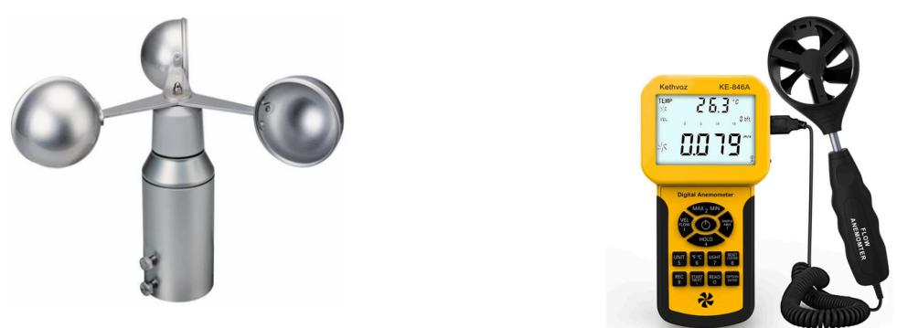  
Fig. 5.1 Anémomètre

Vents marins: Les vents marins peuvent provoquer des vagues et de la5.12 houle, ce qui ajoute des dynamiques supplémentaires aux opérations de levage de charges depuis un navire flottant à l'aide d'une grue montée sur une plateforme fixe. Par exemple, si le navire descend au moment où la charge est saisie, un effet d'« arrachage » se produit, augmentant ainsi la charge réelle et les contraintes sur la grue. Cela est encore plus problématique lorsque des charges sont transférées d'un navire à l'autre, surtout si l'un des navires monte tandis que l'autre descend. 31

Pluie : Une pluie excessive peut déstabiliser les conditions au sol, ce qui5.13 est crucial lors du positionnement et de l'installation des grues. Ce qui était sûr hier peut devenir dangereux aujourd'hui. La pluie peut également réduire la visibilité, compliquant ainsi la communication, notamment pour les signaux manuels.

Neige et glace : La neige et la glace peuvent rendre les sols glissants,5.14 augmentant le risque de glissade ou de chute sous une charge suspendue. Des morceaux de glace peuvent également tomber de grandes hauteurs, comme du haut de la flèche de la grue, et causer de graves blessures. La glace peut temporairement geler l'équipement de sécurité, comme les interrupteurs de fin de course, qui empêchent un levage excessif. Il est donc essentiel de vérifier l'équipement avant utilisation. La neige et la glace sur la surface de la charge peuvent ajouter un poids substantiel et doivent être nettoyées avant le levage. Un froid extrême peut également affecter la sécurité de l'équipement de levage, car l'acier peut devenir cassant et moins résistant à des températures inférieures à $- 2 0 ~ ^ { \circ } C$ .

Orages : Toutes les opérations de levage extérieures doivent être5.15 suspendues en cas d'orages. La flèche de la grue est souvent l'une des structures métalliques les plus hautes de la zone et peut attirer la foudre.

Soleil : Le soleil est généralement apprécié par les travailleurs en5.16 extérieur, mais sa lumière directe peut détériorer certains matériels de levage synthétiques en fibre, comme les cordes et les élingues. Une lumière éblouissante peut également masquer un danger imminent.

# 6.0 NORME ET CONTROLE

Afin d’aider à créer des conditions de travail plus sûres et d’améliorer les 6.1 procédures, il vous a été remis cette norme d’élingage et de levage destinée à vous guider et à vous aider à utiliser les équipements de levage en réduisant les risques lors de vos opérations de levage et d’élingage.

Lorsque vous utiliserez l’un des équipements figurant dans l’index de6.2 cette norme, vous devrez vous référer aux chapitres le concernant.

△ N’oubliez pas: Vous serez souvent responsable de la sécurité de vos collègues et leur vie pourrait un jour dépendre de votre aptitude à travailler sans créer de risques

# 7.0 UTILISATION SECURITAIRE DES GRUES

# Seuls les grutiers dûment accrédités sont autorisés à opérer des grues.

Les grutages constituent un élément majeur des processus industriels.7.1 En fait, dans le secteur offshore, les grues et portiques consitituent l’un des équipements vitaux, car ils permettent de transférer les marchandises entre la terre et les navires. Etant donné les conséquences potentiellement catastrophique d’un accident de grue, ces derniers doivent être correctement entretenus et maintenus en excellent état de marche. De plus, ce personnel doit être capable d’effectuer les contrôles de sécurité journaliers, y compris de la précision des indicateurs de charge, ainsi que la maintenance préventive courante comme le graissage. Pour opérer une grue en toute sécurité, il est absolument essentiel que toutes les charges soient correctement élinguées et que toute cargaison soit correctement emballée, pesée et décrite dans les manifeste afin d’éviter toute surcharge possible.

# Fonctions de base et sécurité de grues 7.2

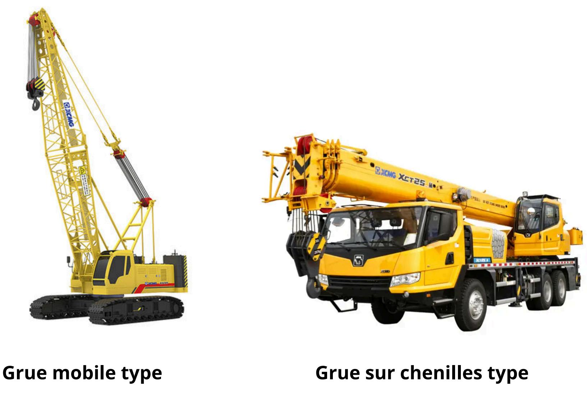  
Fig. 7.1

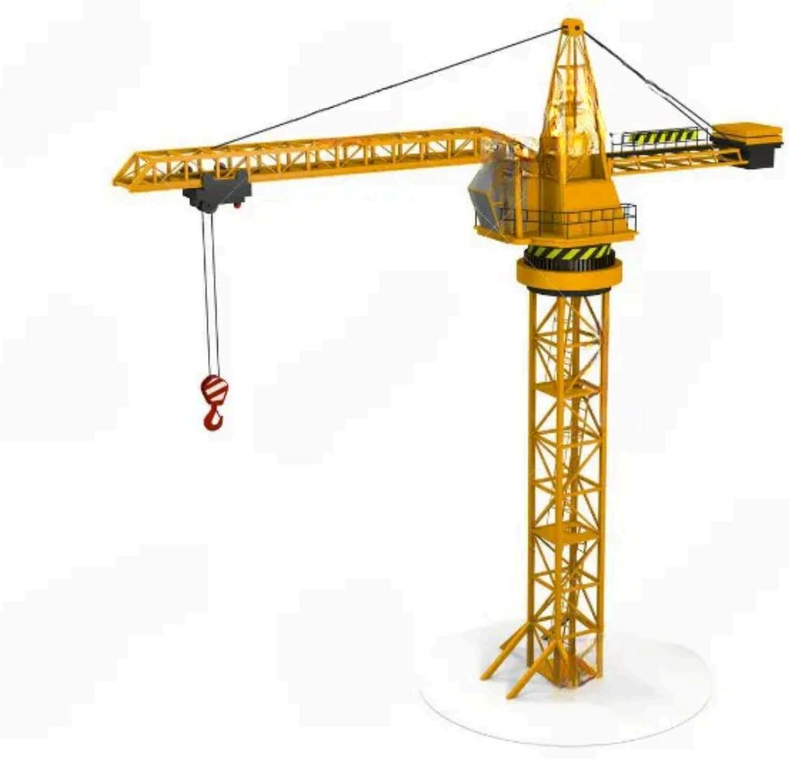

Grue à tour type

Grue à piédestal type

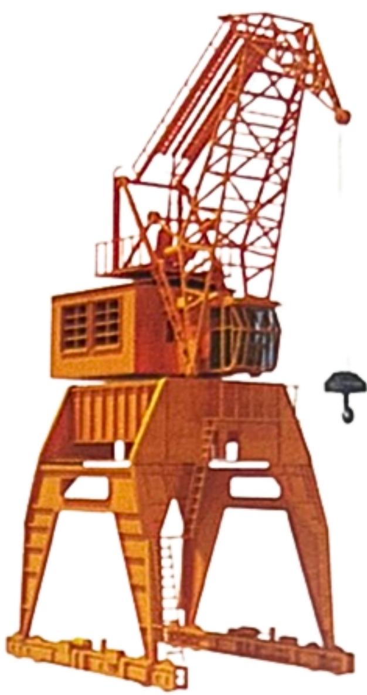  
Fig. 7.2

Grue portuaire type

Pour travailler sans risques avec des grues, il est important de 7.3 comprendre comment elles fonctionnent. Les plus courantes (voir fig. 7.1 et 7.2) comprennent une tourelle et une cabine de commande avec flèche pivotante, un cadre en A et deux treuils, un pour lever/abaisser la flèche et l’autre pour lever et abaisser la charge. Certaines grues intègrent un treuil supplémentaire dit auxiliaire permettant de lever plus rapidement des charges légères.

Le mouvement pivotant dit aussi d’orientation est rendu possible par un pignon sous la grue qui entraîne une couronne fixe sur la tourelle.

Les six mouvements d’une grue sont donc:

1) Relevage de la flèche (pour réduire la portée)   
2) Descente de la flèche (pour augmenter la portée)   
3) Levage de la charge   
4) Descente de la charge   
5) Pivotement à gauche   
6) Pivotement à droite

Pivotement gauche

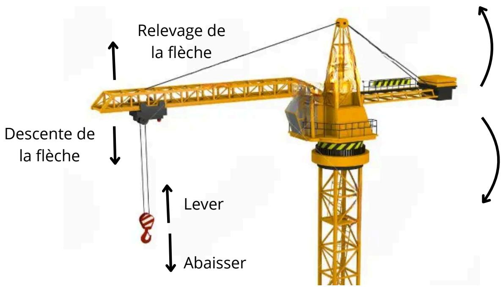

Pivotement droite

Dans l'intérêt de la sécurité et pour aider le grutier, la grue est 7.4 normalement équipée de divers dispositifs qui limitent ces 6 mouvements pour éviter d'endommager la grue. Le cas échéant, ils comprennent:

Lors du relevage de la flèche, une fin de course l'empêchant d'entrer en contact avec les butées arrière.

Lors de l'abaissement de la flèche, une fin de course empêchant l'angle de flèche d'être inférieur à environ $1 5 ^ { \circ }$ par rapport à l'horizontale. (Cette fin de course peut être neutralisée pour permettre de garer la flèche sur son support)

Lors du levage d'une charge, une fin de course empêche de tirer le crochet à travers le mouflage (voir fig. 7.4 ci-dessous).

Lors de la descente de la charge, une fin de course empêche de perdre le câble, le crochet et éventuellement la charge.

Des fins de course de rotation sont quelquefois installées, mais le grutier (et vous, si vous dirigez la grue) devra rester vigilant pour éviter que la flèche entre en contact avec des obstacles tels que d'autres grues, des bâtiments et autres structures. Dans un environnement offshore, vous aurez à éviter la tour de forage, les torchères, les mâts radio, l'helideck, etc.

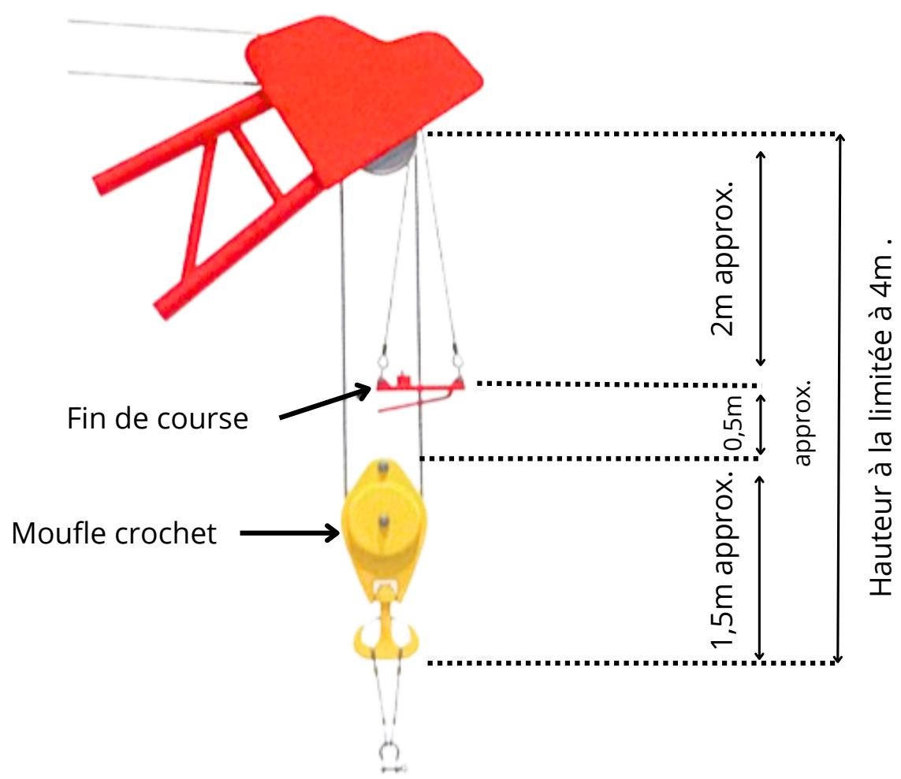  
Fig. 7.4

7.5 En plus des fins de course, il existe un autre dispositif de sécurité dont dispose le grutier, un indicateur automatique de charge admissible avec alarme visuelles et sonores. Il indique à l'opérateur la portée (position du crochet), la CU de la grue à cette portée et la charge réelle sur le crochet. L'alarme visuelle est généralement réglée pour s'allumer à environ $90 \%$ de la capacité de la grue, quelle que soit la portée, tandis que l'alarme sonore se déclenche à environ $100 \%$ de cette capacité, soit en état de surcharge.

Certaines grues sont équipées de dispositifs de sécurité7.6 supplémentaires tels que des systèmes de protection contre la surcharge automatiques (AOPS) ou manuels (MOPS), des systèmes protections de dépassements majeurs (GOP) ou systèmes de protection ultime (UPS) et des indicateurs de vitesse du vent (anémomètres) ou de sa direction (manche à vent).

Lorsque la grue est installée sur une plateforme offshore, la cabine doit7.7 être équipée d'un extincteur, d'une cagoule anti-fumée et d'un gilet de sauvetage.

7.8 Comme tout appareil de levage, les grues ont une charge maximale utile/ charge utile, qui dépend du nombre de brins de mouflage. Évidemment, plus ce nombre est grand plus la capacité de levage est élevée, mais cela diminue la vitesse de levage. Dans le cas d'un levage depuis/vers un navire, cela peut créer un problème si la vitesse de levage est trop faible pour empêcher la charge de taper sur le pont, etc. lorsqu'il se soulève avec la vague suivante. La CMU/ CU baisse également lorsque la portée augmente (voir fig. 7.5 ci-dessous). Referezvous toujours à l'abaque de charges, qui doit être affiché dans la cabine de la grue.

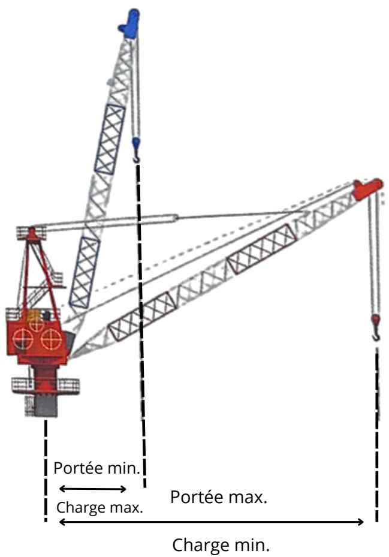  
Fig. 7.5

# 7.9 Responsabilités d'un grutier

Pour recevoir la qualification de grutier, vous devez:

Être âgé(e) d'au moins 18 ans.   
Être médicalement apte, en particulier au niveau de l'acuité visuelle et auditive et des réflexes.   
Avoir une stature permettant d'opérer la grue en sécurité.   
Avoir reçu une formation adéquate à la conduite du type de grue que vous aurez à opérer et être capable de juger des distances, des hauteurs et des espaces libres.   
Être autorisé(e) à conduire la grue.   
Être suffisamment familiarisé(e) avec le fonctionnement de la grue pour pouvoir effectuer les vérifications de routine conformément aux check-lists spécifiques à cette grue lorsque cela est nécessaire.   
Connaître parfaitement le travail des élingueurs et les signaux à bras afin de répondre sans erreur à leurs instructions ainsi qu'à celles du chef de manœuvre.

L'opérateur de la grue doit parfaitement connaître l'élingage des 7.10 charges et autres dispositions pour leur levage. Il est responsable de l'état de la grue et doit la piloter sans dépasser ses limites de sécurité. Il doit être capable de programmer le système indicateur de charge en fonction des conditions ambiantes.

Avant d'utiliser la grue, il effectuera également les vérifications 7.11 préalables. Dans certaines circonstances, il pourra être aidé par le mécanicien de la grue. Il devra évidemment contrôler les niveaux de carburant, de lubrifiant et de fluide de refroidissement, mais également le bon état de la structure. Une fois qu'il aura démarré la grue, il devra la laisser marcher pendant environ 5 minutes (réchauffage), puis vérifier le fonctionnement de toutes les commandes et tous les freins, instruments et dispositifs de sécurité.

L’opérateur doit signaler tout défaut de fonctionnement au mécanicien7.12 afin qu’il soit remédié.

Si la grue opère dans un parc à tubulaires ou lieu similaire, il y aura des7.13 réglages/paramètres spéciaux supplémentaires dont il faudra tenir compte. Ainsi, l’état du sol est crucial. Dans l’idéal, le sol sera ferme et plane et dans le cas contraire, des mesures devront être prévues pour bien répartir la charge entre les stabilisateurs.

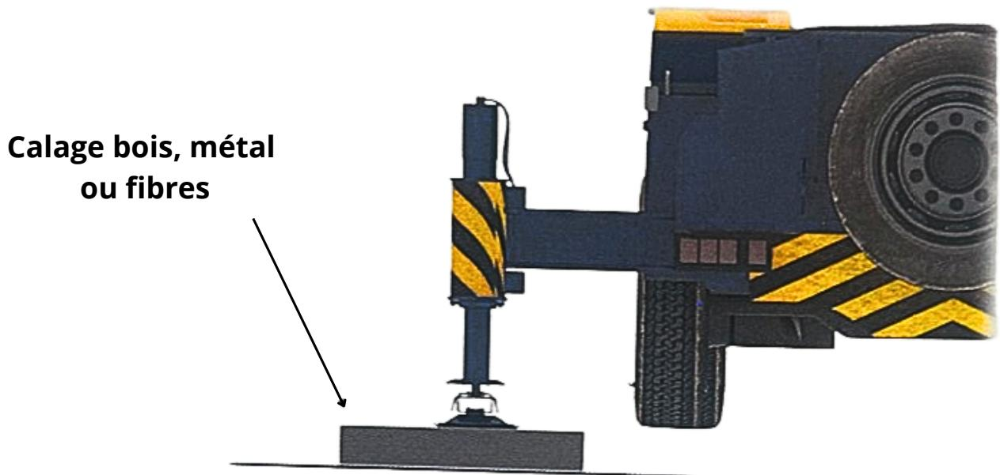

L’opérateur doit également s’assurer dans la mesure du possible de7.14 l’absence de risques sous la surface tels qu’égouts ou conduites de gaz ou d’eau qui pourraient s’effondrer sous la charge.

Une attention toute particulière sera nécessaire en cas de travail à 7.15 proximité des rebords d’excavation ou même d’un quai. Lors d’un transfert de la charge par une poutre stabilisatrice, l’effondrement du rebord pourrait être désastreux.

Si la grue est utilisée pour poser des pipelines ou éléments similaires en7.16 plein air, l’opérateur doit être également conscient des risques potentiels en hauteur tels que les câbles à haute tension (HT). Une distance minimum recommandée doit être respectée par rapport à de tels câbles (Voir 8.41).

Si la grue doit ou pourrait s’approcher plus près d’un câble sous-tension,7.17 le courant devra être coupé. Rappelez-vous que les câbles se balancent quand le vent souffle et que les hautes tensions peuvent provoquer des arcs traversant les espaces importants.

Le risque pour les grues offshore à piédestal est rarement posé par de7.18 tels câbles mais plutôt par une autre grue opérant à proximité. Le grutier devra donc en tenir compte lors du déplacement de charges sur le pont et être particulièrement vigilant.

Dans l’idéal, il devra être en mesure de voir la charge en permanence.7.19 Puisque cela n’est pas toujours possible, il aura donc besoin de quelqu’un pour le guider et faire des signaux. Un chef de manoeuvre, qui ne sera pas l’élingueur, devra systématiquement être désigné.

Enfin, il devra faire particulièrement attention lorsqu’il déplacera la grue 7.20 vers le haut ou le bas d’une pente ou à travers celle-ci.

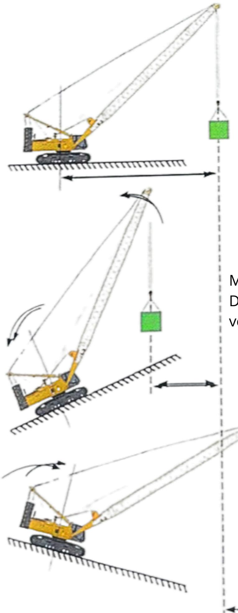

Sol de niveaux: rayon correct Fonctionnement normal sur le sol de niveau

Montée: la portée diminue Dans cet exemple, la grue pourrait basculer vers l’arrière lorsque la charge est descendue

Descente: la portée augmente Dans cet exemple, la grue pourrait basculer vers l’avant lorsque la charge pivote hors de l’aire d’évolution.

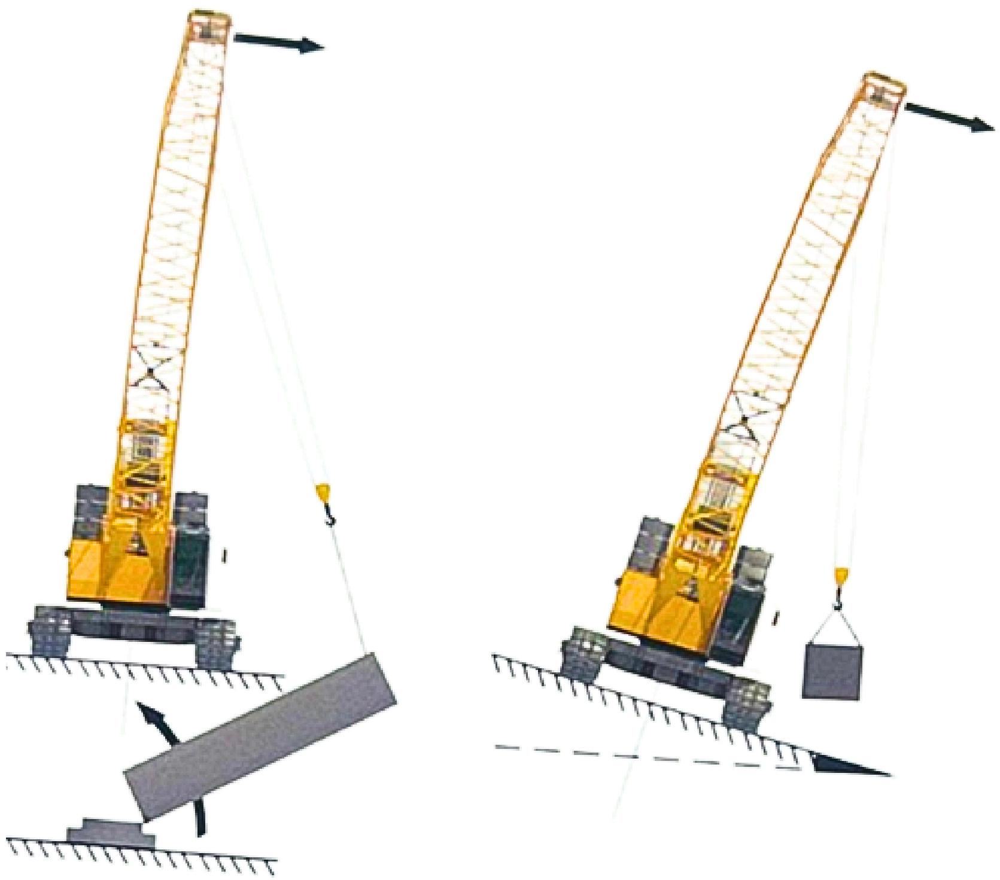  
Fig. 7.8

Dans ces exemples, la charge latérale imposée à la flèche pourrait faire basculer la gue ou provoquer l’affaissement de cette flèche.

Responsabilités d’un élingueur et d’un chef de manoeuvre lors des levages

Pour recevoir la qualification d’élingeur ou de chef de manoeuvre, vous devez:

Etre âgé(e) d’au moins 18 ans.   
Etre médicalement apte, en particulier au niveau de l’acuité visuelle et auditive et des réflexes.   
Etre physiquement apte à réaliser les tâches et activités associées à ce rôle.   
Avoir été formé aux principes généraux de l’élingage et être capable d’évaluer les poids et les distances, hauteurs et espaces libres. Etre capable de sélectionner les équipements d’élingage/levage pour les charges à manutentionner.   
Comprends les signaux manuels et être capable de donner des signaux clairs et précis.   
Etre capable de diriger les mouvements de la grue et le déplacement de la charge tout en assurant la sécurité du personnel et de l’installation.

7.22 La tâche la plus importante de l’élingueur est de préparer et d’élinguer correctement la charge: sélection et montage des accessoires/élingues appropriés, protection de l’élingage si nécessaire, et essai de levage pour vérifier que la charge est stable.

7.23 Dans des circonstances normales, une seule personne sera nécessaire pour signaler et guider la grue (le chef de manoeuvre). Il doit être en permanence en contact visuelle avec le grutier et ne pas avoir à s’occuper de la charge.

Remarque : toute personne pourra signaler un arrêt d’urgence en cas de danger.

Dans le cas d'un navire, les communications radio entre la grue, le chef7.24 de manœuvre et le bord devront être établies avant le levage par-dessus bord.

Sur une installation offshore, toutes les liaisons radio entre le grutier et 7.25 le navire auxiliaire devront se faire par duplex. En cas de rupture de la liaison, le levage devra être immédiatement interrompu et la charge stabilisée.

Dans les cas où deux grues ou plus seront utilisées simultanément, on7.26 choisira des canaux individuels pour chaque grue pour éviter les confusions. Lorsqu'elles sont toutes sur le même canal, on utilisera des signaux à bras pour s'assurer que la bonne grue répond à un ordre particulier donné.

Sur des installations offshores, durant les périodes de silence radio,7.27 tous les talkies-walkies et autres radios devront être coupés et aucune opération de levage avec des navires ne devra avoir lieu. Les levages seront restreints aux opérations sur la plateforme, là où le grutier pourra clairement voir le chef de manœuvre.

# Opérations de levage spéciales 7.28

Levage en tandem: le levage d'une charge avec deux grues peut être dangereux et devra être évité au maximum. Lorsque les dimensions physiques ou le poids de la charge nécessitent l'emploi de 2 grues, cela est acceptable si l'opération est méticuleusement préparée. Le levage doit être supervisé par une personne compétente. Il est absolument vital d'évaluer avec précision la charge susceptible d'être imposée à chaque grue. Il est également nécessaire d'évaluer soigneusement comment et jusqu'où la répartition des charges peut varier au cas où la charge ne serait plus d'aplomb ou si l'une ou les 2 grues devaient abaisser ou relever leur flèche, se déplacer ou pivoter. Les câbles de levage ne seraient plus verticaux

Si n'importe laquelle de ces circonstances venait à se produire, cela pourrait imposer une charge supplémentaire à l'une ou aux 2 grues, ce qui pourrait en compromettre la stabilité ou les endommager sérieusement.

Un élingage spécial pourrait être nécessaire pour tenir compte de la7.29 variation maximale de distribution des charges et de toute charge angulaire qui pourrait apparaître durant l'opération en tandem.

Toutes les opérations de levage en tandem devront être soigneusement7.30 planifiées à l'avance par une personne ou équipe compétente. On utilisera autant que possible des grues de capacité égale et de caractéristiques similaires. On sélectionnera des grues et des élingages ayant une marge de capacité supérieure à celle nécessaire si la charge était levée par une seule grue. Il est recommandé, à moins d'utiliser des cellules dynamométriques, que chaque grue soit capable de soulever 75 $\%$ de la charge totale à la portée et au rayon de travail requis. En cas d'utilisation de cellules dynamométriques, chaque grue devra uniquement être capable de soulever $2 5 \%$ de plus que sa part estimée de la charge.

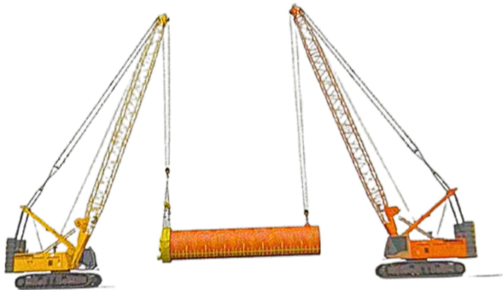  
Fig. 7.9

Chaque grue doit généralement être capable de soulever $7 5 \%$ de la charge totale

7.31  Une personne compétente doit être désignée pour superviser l'opération et les signaux qu'elle fera à chacun des grutiers devront être clairs et bien compris. Les opérations de levage à plus de 2 grues nécessiteront la réalisation d'évaluations et de contrôles plus poussés.

Remarque: nous estimons que chaque grue devrait normalement être capable de soulever $7 5 \%$ de la charge totale, mais il est possible de réduire cette marge de sécurité dans des cas spéciaux. Dans de tels cas, nous vous recommandons de soumettre le plan de levage et les charges calculées à votre organisme de certification pour approbation. Les barges à grues, par exemple, ont leurs propres règles pour le levage en tandem comme convenu avec leur organisme de certification, étant donné qu'avec des charges extrêmement lourdes (des centaines de tonnes) on ne peut pas s'attendre à ce que chaque engin puisse recevoir $7 5 \%$ de la charge

7.32  Redressement: les opérations de redressement ou $\pmb { \mathscr { K } }$ tailing » sont similaires aux opérations de levage en tandem avec deux grues, mais une fois que la charge a décollé du sol, une grue l'abaisse tandis que l'autre continue à la lever, ce qui entraîne sa rotation sur $9 0 ^ { \circ }$ .

Attention! Lorsque la charge doit aussi être tournée sur $9 0 ^ { \circ } .$ , le poids TOTAL sera transféré d'une des deux grues à l'autre.

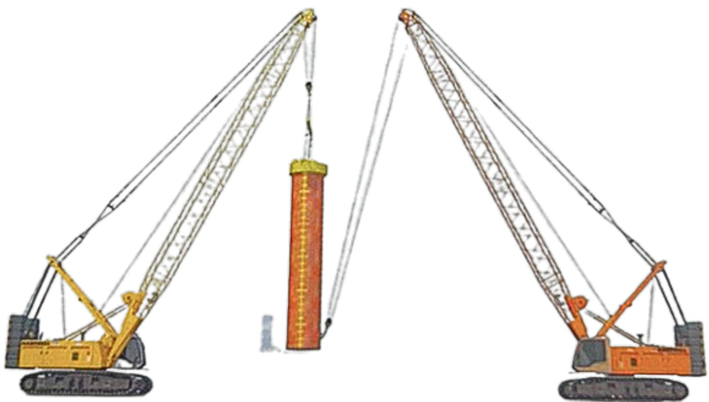

Dans l’idéal, chaque grue devrait être capable de soulever la charge intégrale, à moins qu’une autre procédure ait été prévue.

Conditions ambiantes: p. ex. vitesse du vent, rafales, etc. pouvant7.33 provoquer une surcharge en poussant la charge au-delà du rayon de travail. Lors d'un levage au-dessus d'un plan d'eau ou en mer, des vents violents peuvent réduire la capacité de levage d'une grue en raison des facteurs dynamiques causés par l'augmentation de la hauteur des vagues et par la houle. Des tableaux de charge/rayon de travail/état de la mer doivent être affichés dans la cabine pour connaître les réductions de charge applicables.

Avant de commencer le levage, la personne qui le commande a la7.34 responsabilité de s'assurer que tout ce qui pourrait retenir la charge a été enlevé/démonté (arrimage sur pont, berceau de transport, supports, etc.) et que le crochet est directement au-dessus du centre de gravité (lorsqu'il est connu). Le ou les câbles de levage doivent être verticaux pour minimiser les mouvements de la charge lorsque l'on commence à la soulever.

Lors d'un levage sur un navire, le grutier et l'équipage/commandant du 7.35 navire doivent tous s'assurer que tous les arrimages ont été enlevés et que le levage est effectué en sûreté, avec le minimum de rotation/balancement et de charges par à-coups. (Lorsque le levage se fait entre deux navires flottants, les effets du tangage et du roulis sont plus importants car ils peuvent doubler les forces dynamiques normales)

Lorsque l'on procèdera au levage de charges lourdes, la capacité de7.36 charge maximale dépendra du nombre de pièces de ligne ; elle diminue lorsque le rayon de travail augmente. Lors de la préparation d'un levage lourd, confirmez le poids de la charge, déterminez le rayon maximum requis pour sa préhension, son transfert et sa dépose, puis consultez l'abaque de charge/portée de la grue pour vous assurer que le mouflage est adéquat.

Dans l'idéal, l'opérateur devrait être en mesure de voir en permanence 7.37 la charge, mais selon le type et la conception du navire/des installations, cela n'est pas toujours possible. Dans de tels cas, il devra être en contact radio avec le chef de manœuvre et/ou être dirigé par un chef de manœuvre en contact visuel avec la charge et clairement visible par l'opérateur.

Avant tout levage, vérifiez bien l'état et l'équilibrage de tout l'élingage et 7.38 autres accessoires de levage. Au cas où ils devraient être maintenus en position pendant la mise sous tension du/des câbles de levage, utiliser des perches pour tirer/pousser - ne jamais passer les doigts autour des élingues ou les agripper.

Le grutier devra également décider si une corde stabilisatrice est7.39 nécessaire pour contrôler la charge une fois suspendue en l'air. Ces cordes sont particulièrement recommandées dans le cas de charges longues, pour lesquelles ces premières devront être attachées à l'une ou aux deux extrémités afin de contrôler les mouvements de rotation. Ces cordes doivent être suffisamment longues pour que le ou les opérateurs n'aient pas à se tenir sous la charge pendant le levage. Elles doivent toujours être arrimées à la charge, pas à l'élingage (voir § 8.19).

Lorsqu'une opération de levage nécessite plus d'un opérateur, il est7.40 essentiel de s'assurer que les communications entre eux soient distinctes. Pour cela, utiliser de préférence des talkies-walkies.

Toutes les instructions données au grutier (à part un arrêt d'urgence),7.41 que ce soit par contact radio ou par le chef de manœuvre, ne doivent être données que par le chef de manœuvre ou la personne contrôlant le levage.

Cependant, l'ordre ou le signal d'ARRÊT D'URGENCE peut être donné par toute personne voyant une situation dangereuse apparaître durant l'opération en cours.

Faites particulièrement attention lors du levage de charges ayant une7.42 grande surface, qui donnent une grande prise au vent. Si nécessaire, prévoyez une/plusieurs cordes de manœuvre, ou pour des charges lourdes des câbles reliés à des treuils, pour aider à contrôler la charge.

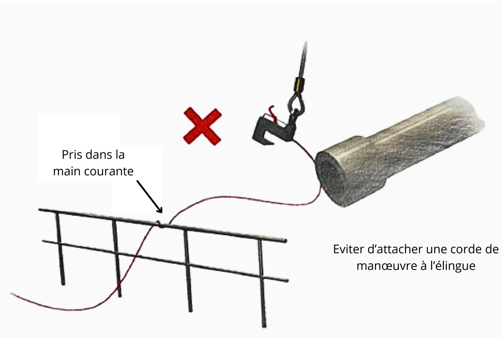  
Fig. 7.19

La majorité des grues offshores sont équipées de crochets en C pour 7.43 éviter au maximum qu'ils se prennent dans des obstacles tels que des mains courantes, etc. Les grues de plus grande taille sont généralement équipées de crochets doubles qui pourraient avoir un effet sur la conception de l'élingue (voir fig. 7.21).

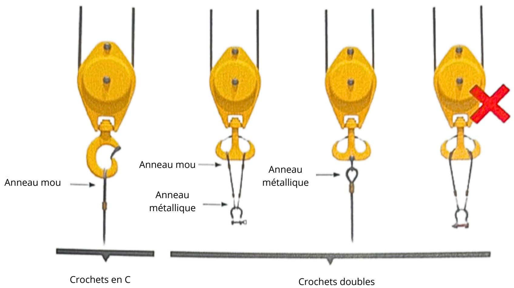

# Ponts roulants 7.44

Lorsque vous opèrerez ce type de grue, vous remarquerez que la plupart des commandes ont deux vite te et normale). Commencez toujours par la vitesse lente pour vous assurer que la charge est stable et pour plus de sécurité avant de lever/vous déplacer à vitesse normale.

Au cas où la charge se balancerait lorsque vous stoppez, ce mouvement7.45 peut être éliminé en déplaçant la grue dans le sens du balancement (lorsque la charge va vers la gauche, avancez la grue dans la même direction).

Remarque: vous devrez vous entraîner à cette manœuvre avec une charge sûre et dans une aire vaste bien dégagée avant de la faire dans les conditions réelles.

# 7.46 Grues de bord

Les grues de bord doivent être équipées de:

• Systèmes de communication qui permettent:   
- D'attirer l'attention du personnel (tel qu'un avertisseur sonore)   
- Une communication verbale avec le personnel (tel qu'un système de haut-parleurs   
- Une communication avec l'équipage, les navires ravitailleurs et la salle de contrôle par radio bidirectionnelle   
- Une utilisation mains libres   
• Une cabine d'opérateur fixe doit être équipée d'une caméra de flèche • Abaques de charges   
• Indicateur de portée ou d'angle   
• Un dispositif de restriction de la hauteur maximum de la flèche afin d'empêcher cette dernière d'être entraînée contre les butées arrière • Un dispositif de restriction de la hauteur minimum de la flèche afin d'empêcher cette dernière d'être abaissée au-delà de la portée maximale admissible   
• Des disjoncteurs de limite supérieure afin d'empêcher les moufles d'être entrainées dans les réas   
• Un dispositif anti-rapprochement des moufles du treuil principal et de l'auxiliaire, ou système équivalent lorsqu'un tel dispositif ne peut être installé   
• Des instruments indiquant de manière continue la charge sur le crochet ainsi que la charge nominale pour chaque portée. L'indicateur automatique de charge doit produire un avertissement clair et continu lorsque la capacité nominale de la grue est   
• Dispositif d'arrêt d'urgence   
• Un extincteur portable adapté aux incendies de classes A, B et C   
• Cagoule anti-fumée   
• Gilet de sauvetage   
• Éclairage de sécurité   
• Un étiquetage clair en anglais et dans la langue locale dominante indiquant la fonction des commandes et lisible à toute heure du jour ou de la nuit.   
• Registre de collision de la grue

L'entretien de routine des grues doit être effectué conformément aux documents de référence.

Un carnet de bord de la grue doit être rempli par le grutier.

# 7.47  Grues et dispositifs de manutention de bloc d'obturation de puits, grues de manutention de conduites, portiques et pont roulants

Les grues et dispositifs de manutention de bloc d'obturation de puits, grues de manutention de conduites, portiques et pont roulants doivent intégrer:

• Un dispositif d'arrêt d'urgence accessible au personnel à proximité   
• Un registre des collisions   
• Des butées d'arrêt pour rails/portiques/ponts   
• Un système de protection contre la surcharge

Les grues se déplaçant sur des rails situés sur le pont (pont principal ou niveau supérieur) doivent intégrer un système d'avertissement sonore et visuel afin d'alerter le personnel travaillant à proximité lors de leur déplacement.

# Procédures radio pour les opérations de levage7.48

# I) Considération générales

Les messages radio ne devraient être utilisés que pour le travail et pas pour des conversations oiseuses. Dans la règlementations radio, les injures/grossièretés sont interdites.

# II) Etablissement des liaisons

Le grutier et le chef de manœuvre doivent établir leurs modalités de liaison radio (le centre radio indiquera le canal de service) avant le début de toute opération de levage. Chaque fois que le chef de manoeuvre change de position, il doit vérifier la communication avec le grutier

# III) Canaux radio

Quand plus d’une grue opèrent dans la zone, chacune doit avoir son propre canal. Cela est particulièrement important lors de travaux simultanés avec des navires. Lorsqu’ils participent au levage, il convient également d’établir une communication radio avec ces navires avant de commencer la manutention. On pourra par exemple passer de la VHF à l’ UHF ou inversement.

# IV) Grue communiquant sur des canaux différents

Lorsque deux grues sont sur des canaux différents au cours d’un transbordement en tandem, le chef de manœuvre prévues et la position des extrémités de leur flèche afin d’éviter tout contact entre les grues durant les opérations.

# V) Grues communiquant sur le même canal

Cependant, si elles utilisent le même canal, par exemple lors d’un levage en tandem, il convient d’utiliser des signaux à bras individuels pour chaque grue avant de communiquer par radio. Ces appels radio doivent commencer par la position de la grue concernée sur la plateforme/installation, p ex. bâbord/tribord/centre, ect. Ces conventions doivent être utilisées à chaque appel pour empêcher toute confusion avec d’autres communications radio

# VI) Levage en aveugle

Durant de tels levage en aveugle, lorsque la charge est levée , descendue ou suspendue pendant de longue périodes, éviter de maintenir le bouton d’émission (radio) enfoncé pendant tout le levage. L’pération ne sera sinon pas en en mesure de confirmer ou répondre. De même, évitez de donner des instructions au début du levage puis cesser toute communication jusqu’a ce que le levage soit presque terminé. Donnez l’ordre de lancement puis continuez à parler au grutier à peu près toutes les 10 secondes pour le rassurer en lui indiquant que le contact est toujours établi et que vous poursuivez la gestion du levage. Stoppez toujours un mouvement de la grue avant d’en commencer un autre.

# VII) Interférences

Lorsque vous dirigez des opérations de levage, assurez-vous que les employés travaillant à proximité immédiate et communiquant sur le même canal ont $\lor =$ bien éteint leurs systèmes radios afin de réduire le risque d’interruptions ou d’interférences avec vos instructions.

Attention! Panne de communication: les communications radio avec le grutier doivent être maintenus en permanence durant les opérations de levage. Au cas où elles seraient interrompues par un tiers ou de manière permanente, toutes ces opérations devront cesser sur le champ et ne reprendre que lorsque la liaison aura été rétablie.

Talkie-walkie type (fonctionnement et commandes )

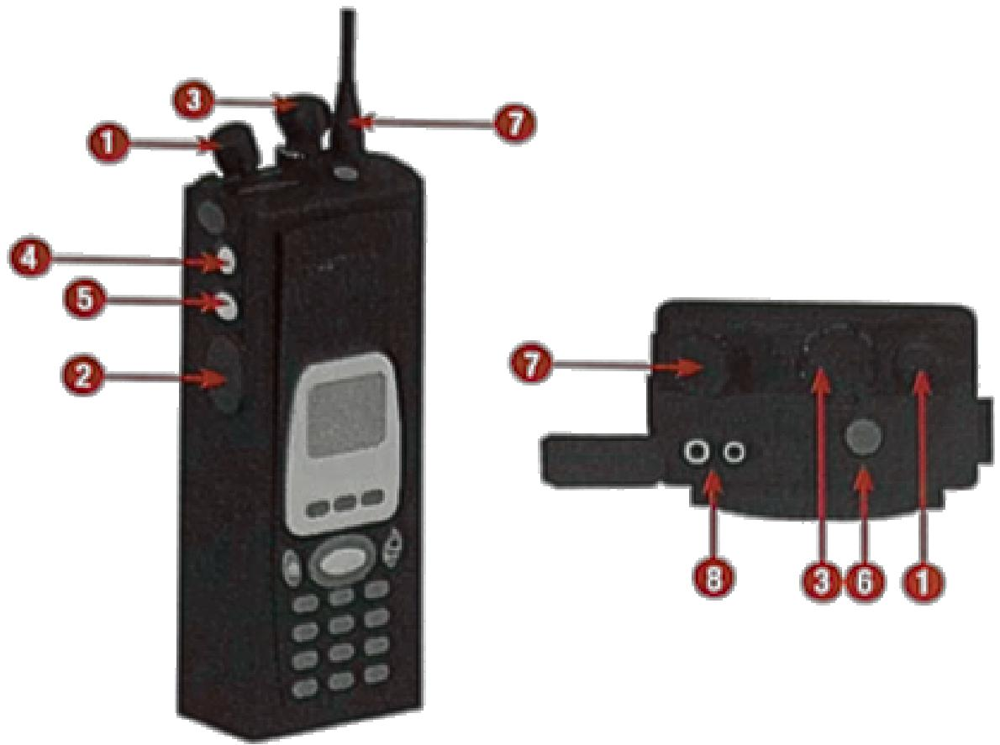

(Assurez vous que vous êtes bien familiarisé avec le modèle que vous utilisez )

Marche-Arrêt/ Contrôle du volume Met la radio on / off et ajuste le volume du haut parleur.

Bouton d’émission Sélecteur de canaux/balayage Bouton de commande

Pressez le bouton pour parler, relâcher pour écouter.   
Sélectionner le canal de fonctionnement ou la fonction de balayage.   
Réglage du volume ou balayage/suppression du canal nuisible.   
Lorsqu’il est enfoncé, permet d’écouter toute activité sur le canal.   
Ni le silencieux de porteuse, ni le silencieux à commande par tonalités, ni le silencieux DPL ne sont actifs lors de l’écoute.

Bouton d’écoute

Sélectionne le mode d’utilisation, silencieux de porteuse ou silencieuse PL / DPL.

Voyant tricolore   
Rouge continue   
Rouge clignotant lors de l’émission   
Rouge clignotant en réception   
Vert clignotant   
Jaune continu   
$=$ Emission radio   
$=$ Batterie faible   
$=$ Canal occupé   
$=$ Balayage   
$=$ Ecoute du canal active

Connecteur d’antenne Connecteur d’accesoires

Connecteur pour casque externe ou un microphone à distance

# IX) Précaution d’emploi et sécurité

Toujours vérifier que les piles/ la batterie sont chargées à fond avant de prendre l’appareil pour son poste. S’assurer que le micro n’est pas exposé à la pluie. Si vous ne disposez pas d’une coque de transport permettant de protéger l’appareil, une mesure de protection simple consiste à utilisier un sachet plastique ou à placer un morceau de film étirable sur le micro pour éviter qu’il ne soit trempé. Ne pas transporter les talkies-walkies dans la poche. Toujours s’assurer qu’ils sont dans leurs sacoche protectrice, attachés au corps soit par une bandoulière à l’épaule, soit à la ceinture; tout en protégeant le talkie-walkie cela évitera tout risque de blesser quelqu’un s’il tombe d’une certaine hauteur lorsqu’il vous échappera ou en montant une échelle.

Attention ! Etant donné que ces radios ont une puissance d’émission non négligeable, si l’antenne venait à être endommagée et la partie centrale exposée, l’antenne devrait être immédiatement remplacée non seulement afin de maintenir des performances optimales, mais aussi pour des raisons de sécurité pour l’utilisateur.

# X) Silence radio

Sur une installation offshore, pendant les périodes de silence radio, les systèmes radio des grues seront isolées. Aucun levage entre un navire et la plateforme ne devra avoir lieu. Les opérations de grutage seront restreintes aux zones où le grutier pourra clairement voir l’opération et le chef de manoeuvre.

# 8.0 UTILISATION SECURITAIRE DES PALANS A CHAINES

# 8.1 Sélection

Pour sélectionner un palan, la premère chose à considérer est la CMU / CU, qui doit être choisi selon la charge à soulever. Lorsque celle-ci est inconnue, on calcule son poids en ajoutant un certain pourcentage à titre de marge d’erreur. La sélection peut alors être effectuée.

Attention ! Eviter de lever des charges de moins de $10 \%$ de la capacité du treuil et NE JAMAIS lever des charges de moins de $5 \%$ de celle-ci, car elles pourraient ne pas être suffisantes pour activer le frein à friction.

La seconde chose à considérer est la hauteur perdue minimum, étant8.2 donné que le manque d’espace vertical est souvent un problème dans les espaces confinés (p. ex. salles des machines ou ateliers avec palonniers bas). Cette hauteur varie selon le fabricant et/ou le modèle et peut influencer la sélection.

La troisième chose à considérer est la hauteur libre sous crochet8.3 (hauteur de levage). Les palans à chaînes de levage ont généralement une HLSC standard de 3m (les chaînes de levage font généralement un demi-mètre de moins), mais il existe des modèles avec pratiquement n’importe quelle hauteur de levage de $1 , 5 - 1 , 8 m ,$ mais peuvent également être équipés de chaînes plus longues si l’application le demande.

# 8.4 Vérifications avant utilisation

Avant d’utiliser un palan à chaîne, il est nécessaire de s’assurer qu’il est en bon état de fonctionnement et qu’il est sûr. Les vérifications suivantes doivent être effectuées :

# Vérifier que:

La CMU/CU est adéquate pour la charge   
Le code couleur est à jour et le palan porte un ${ \mathsf { n } } ^ { \circ }$ d’installation / Une marque d’identification.   
Les linguets de sécurité sont présents.   
Il n’y a aucun signe d’utilisation abusive, p.ex. crochet étiré, boîtier fissuré, chaîne étirée/déformée, etc. Pour un palan à plusieurs brins, les chaînes ne sont pas tordues entre la moufle inférieur et le boîtier de levage (ce qui est généralement dû au retournement de la moufle inférieur)   
Le bruit du cliquet est net (un clic clair et fort) quand on fait tourner la roue de chaîne de levage ou que l’on actionne le levier.

Attention! Une chaîne de levage étirée ou un levier de manoeuvre 57 déformé pourraient indiquer que le palan a été surchargé.

# 8.5 Installations des palans

il est essentiel de s’assurer que l’élément structurel auquel le palan est suspendu est adéquat pour la charge prévue. Celle-ci doit comprendre le poids du palan lui-même plus celui des accessoires à crochets tels qu’élingues, manilles, chariots, etc.

Lorsque l'on utilisera un palan suspendu à un crochet, ce crochet 8.6 supérieur doit être attaché à son support de manière telle que ce support s'adapte librement dans le siège du crochet et n'exerce aucune charge latérale sur le point de contact.

Le crochet supérieur doit être muni d'un linguet de sécurité.8.7

8.8 Après l'installation, on s'assurera que la chaîne de levage et les chaînes de charge tombent librement, ne sont pas tordues et ne font pas de nœuds. On vérifiera en particulier, dans le cas de palans multibrins, que la moufle inférieure ne s'est pas retournée entre les boucles de chaîne, tordant la chaîne de charge. Dans ce cas, retournez cette moufle jusqu'à ce qu'il n'y ait plus de tours.

Fig. 8.1

Vérifiez la longueur de la chaîne de charge pour vous assurer que le8.9 crochet inférieur peut atteindre le point le plus bas requis sans que vous ayez à sortir toute la chaîne. En effet, dans un tel cas, cela pourrait appliquer une contrainte excessive à l'ancrage de l'extrémité libre (qui n'est pas réellement un composant porte-charge).

Attention! Un palan ne doit être utilisé que pour lever et abaisser: les charges ne doivent pas être laissées suspendues sans surveillance, même peu de temps. Un élingage de secours devra être prévu et utilisé dans ce cas.

# 8.10 Toujours

S'assurer que l'élingage de la charge (élingue/manille/anneaux) repose correctement dans l'anse du crochet inférieur et permet de fermer le linguet de sécurité.

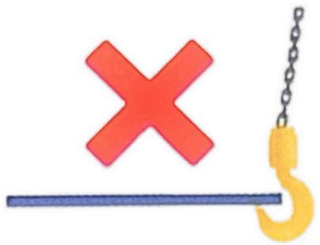  
Fig.8.2

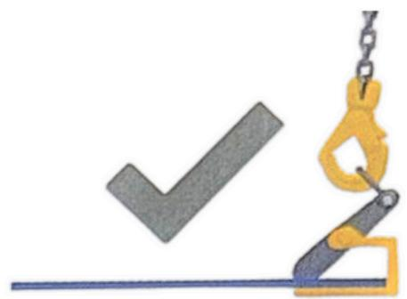

S'assurer que la charge est correctement équilibrée.   
Placer le palan directement au-dessus du centre de gravité de la charge (s'il est connu)   
S'assurer que tous les obstacles ont été enlevés (p. ex., boulons de fixation de la charge).

# Ne jamais 8.11

Charger les extrémités des crochets.

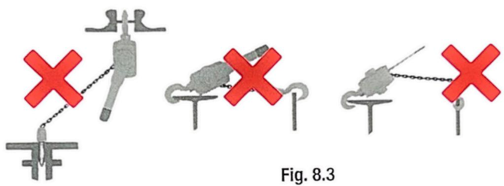

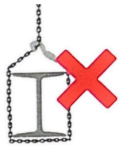  
Fig.8.4

# Ne jamais

Utiliser la chaîne de charge comme élingue, c.-à-d. enroulée autour de la charge et fixée à elle-même Déplacer une charge au-dessus de personnes. Forcer de manière excessive sur la chaîne de commande ou le levier pour éviter les surcharges sur le palan. Utiliser une rallonge du levier (tube) pour exercer plus de force (palans à chaînes). Laisser une charge suspendue sans surveillance sans soutien/ élingage supplémentaire (secondaire).

Remarque: à l'origine, on recommandait uniquement l'usage de palans à chaîne à la verticale puisque les encliquetages fonctionnaient purement par gravité. De nos jours, ces dispositifs sont maintenus par un voire deux ressorts. Les palans à chaînes peuvent donc être utilisés jusqua un angie de $45 ^ { \circ }$ par rapport à la verticale (p. ex. dans une situation de $\pmb { \mathscr { Q } }$ traction transversale ». Les palans à levier peuvent quant à eux être utilisés à l'horizontale.

Attention! Si une charge est laissée suspendue, la zone sous la charge doit être balisée pour éviter tout danger pour le personnel.

Faire une mise en charge brusque   
Laisser tomber le palan sur le sol   
Ne jamais utiliser un palan à chaîne comme élingue ou brin d’élingage lors de l’utilisation d’une grue pour un levage. Les palans à chaînes sont conçues pour être chargés de manière graduelle, c’est à dire, tout en tendant le jeu de la chaîne à l’aide du réducteur. LES PALANS A CHAINES NE SONT PAS CONCUES POUR RESISTER A DES MISES EN CHARGES BRUSQUES auxquelles ils pourraient être sujets lorsque la charge est plus rapidement levée ou même rapidement “saisie” par une grue. Il est fort possible que le mécanisme de freinage soi endommagé ou, encore plus probable, subisse une panne catastrophique.

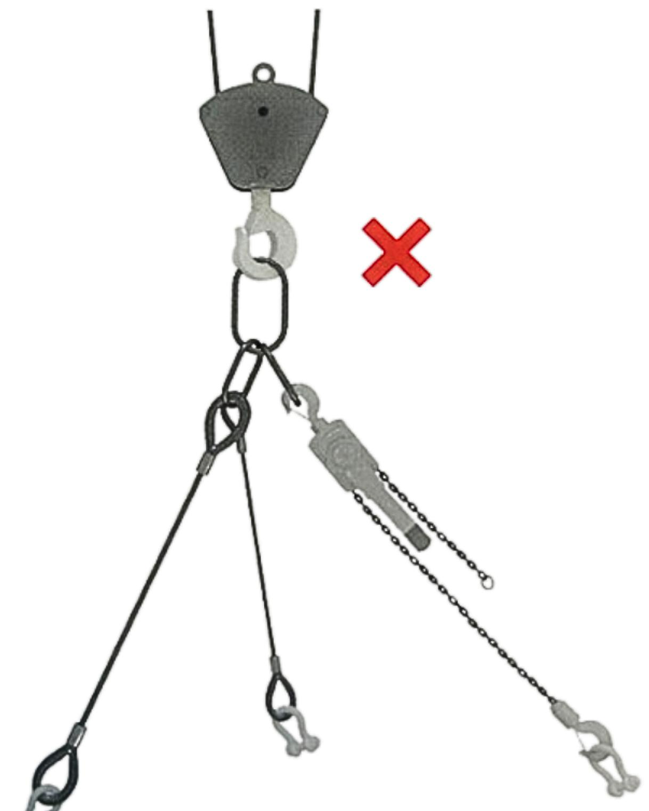  
Fig. 8.5

Attention! Il est interdit, dans les circonstances décrites ci-dessus, de “déclasser” un palan. Aucun fabricant de bonnes foi ne saura accepter un tel usage abusif de ses produits.

Lorsqu’un ajustement doit être possible pour le positionnement final ou pour l’installation de la charge, vous pouvez monter un palan à chaîne de sorte que le brin d’élingage supporte l’ensemble des charges dynamiques. Une fois le mouvement vertical de la grue terminé et une fois que cette dernière peut jouer un rôle de “chariot aérien automobile”, c’est à dire une structure fixe à laquelle le palan à chaîne peut être suspendu, ce dernier peut alors supporter la tension de l’élingage qui peut donc être déconnecté. A partir de là, le palan à chaîne peut être utilisé pour réaliser l’ajustement/le positionnement final requis

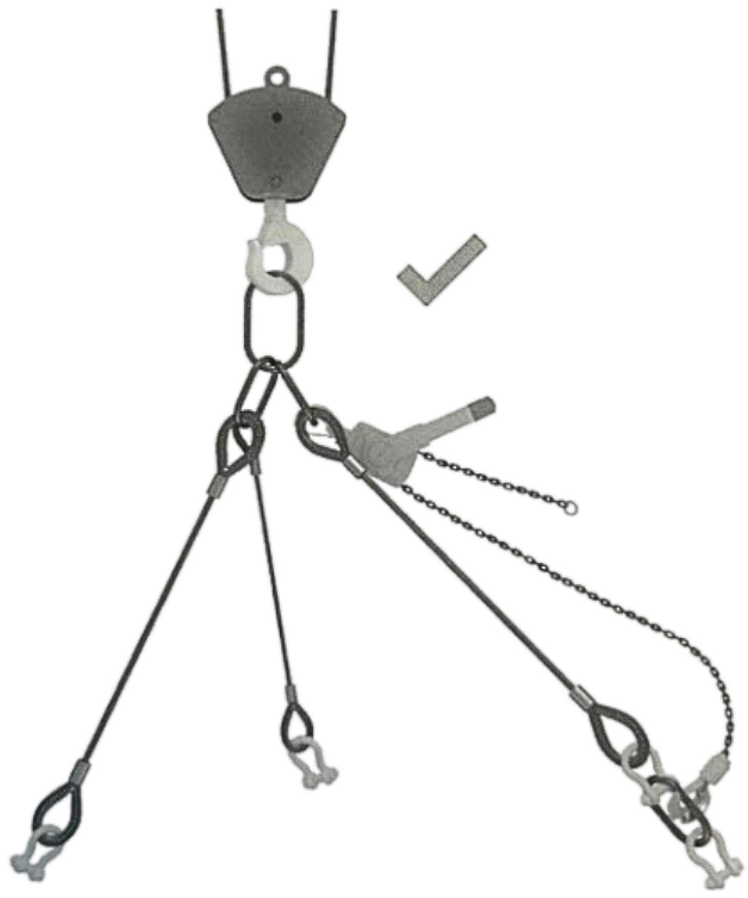  
Fig. 8.6

# Utilisation d'un palan sous l'eau 8.12

Il peut parfois être nécessaire d'utiliser un palan sous l'eau, manipulé par des plongeurs immergés. Il est essentiel de vérifier que le type de palan sélectionné est adapté, car le matériau des disques de frein pourrait ne pas convenir. Consultez le fabricant pour confirmation. Une fois le travail terminé, un palan utilisé sous l'eau doit être envoyé à un atelier agréé, démonté complètement, purgé à l'eau douce, regraissé, remonté et testé avant toute nouvelle utilisation.

# Palans pneumatiques 8.13

Pour les palans pneumatiques, assurez-vous qu'une unité de conditionnement d'alimentation en air comprimé avec filtre, graisseur et détendeur est installée et réglée à la pression correcte, afin d'éviter toute contamination de l'air du moteur.

Testez le palan sur toute la longueur de la chaîne de charge et vérifiez le8.14 bon fonctionnement des fins de course haut.

Vérifiez les commandes du boîtier et assurez-vous que les boutons 8.15 poussoirs s'enfoncent sans problème et remontent en position neutre lorsqu'ils sont relâchés.

Par temps extrêmement froid, il est possible d'introduire un produit8.16 dégivrant via le graisseur pour prévenir tout givrage du moteur pneumatique.

# L'UTILISATION SÉCURITAIRE DES PALANS A CÂBLE (Tirfors)9.0

Les palans à câble, disponibles en trois capacités, peuvent être utilisés9.1 pour lever des charges (avec un facteur de sécurité de 5/1), ainsi que pour tracter des charges (avec un facteur de sécurité d'environ 3,3/1) soit;

# CU (levage)

# Capacité (traction)

800 kg 1 200 kg   
$1 6 0 0 \mathsf { k g }$ 2 500 kg   
3 200 kg 5 000 kg

# 9.2 Sélection des palans

Il est crucial de distinguer entre l'utilisation de levage et l'utilisation de traction :

Lors d'une utilisation de levage, la charge ne reste pas stationnaire en cas de défaillance du palan ou de l'un de ses accessoires. Lors d'une utilisation de traction, la charge reste stationnaire en cas de défaillance du palan ou de l'un de ses accessoires.

Choisissez donc la capacité en tenant compte de cette caractéristique, ainsi que de la charge à déplacer (voir exemples 1 à 4).

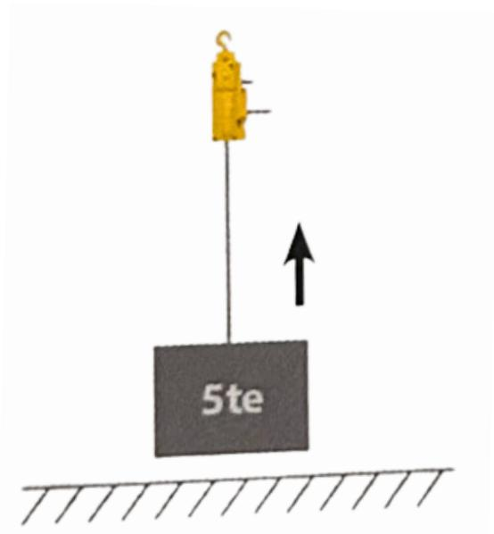  
Fig. 9.1

# Levage simple

(en cas de défaillance du palan ou du câble, la charge tombe)

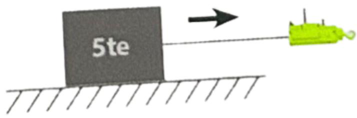  
(en cas de défaillance du palan ou du câble, la charge reste stationnaire)

# Traction simple

Un palan 3 t peut soulever une charge de 3 t (estimée), mais exercer une traction de 5 t, le facteur de sécurité étant réduit étant donné que l'opération est moins risquée.

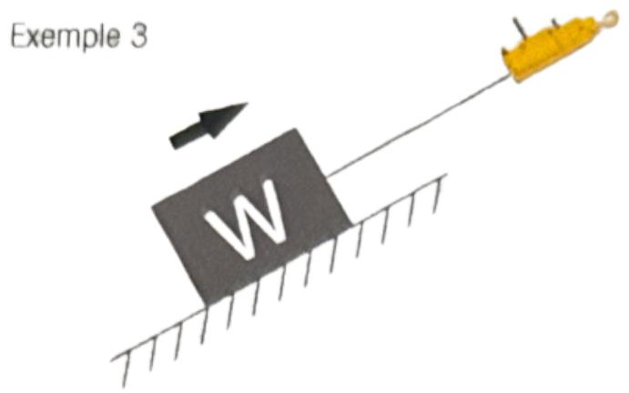

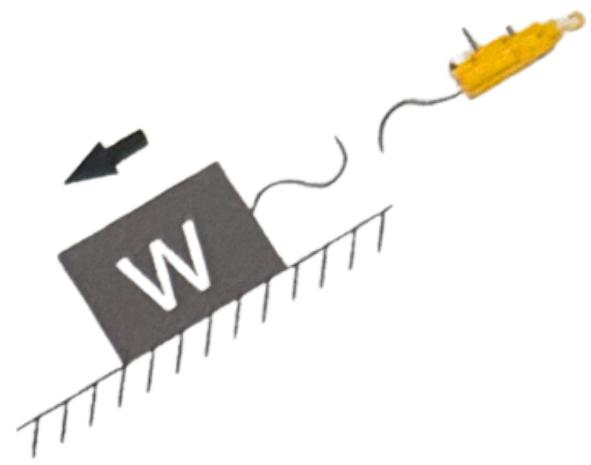

Tirer vers le haut sur une pente $=$ levage (en cas de défaillance du palan, la charge dégringole le long de la pente, donc elle NE RESTE PAS stationnaire).

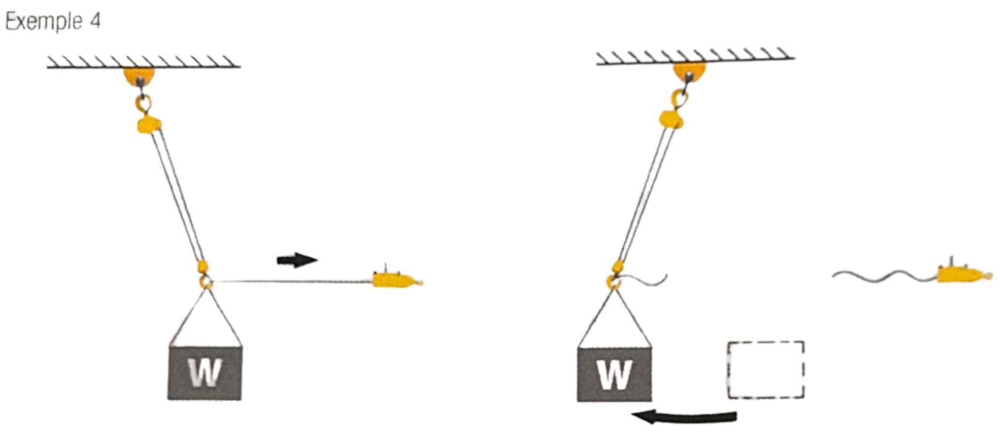

Traction transversale $=$ levage (en cas de défaillance du palan ou du câble, la charge repart, donc elle NE RESTE PAS stationnaire).

9.3

Les palans à câble sont équipés de câbles spéciaux qui résistent à la forte pression des mâchoires, évitant ainsi les nids de fils brisés. La longueur standard du câble fourni est de 20 mètres, mais des câbles plus courts ou plus longs sont facilement disponibles.

9.4

Les palans à câble sont généralement actionnés à la main, mais des versions hydrauliques existent pour des besoins spécifiques, notamment pour des levages ou tractions particulièrement longs.

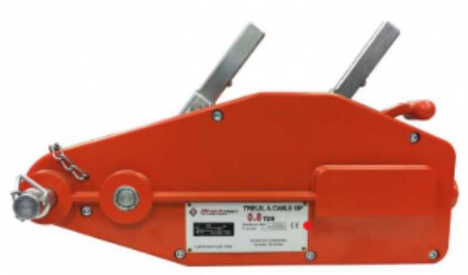  
Fig. 9.2

Palan manuel standard

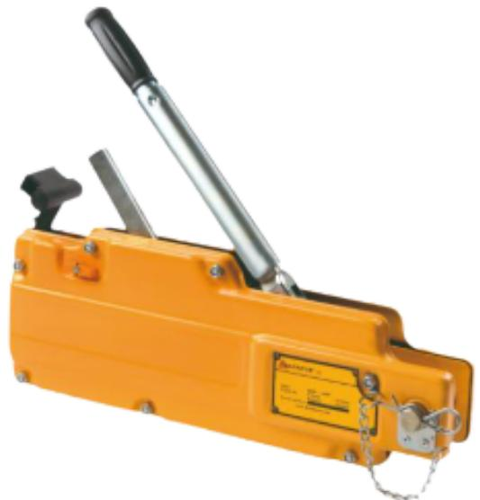  
Palan hydraulique

# 9.5 Sécurité

Il est impératif d'utiliser le câble correct pour le type de palan, car ces appareils sont conçus pour opérer avec un diamètre spécifique qui varie selon les fabricants de câbles. Voir tableau ci-dessous.

<table><tr><td rowspan=1 colspan=1>Fabricant</td><td rowspan=1 colspan=3>A                                        B                                        C</td></tr><tr><td rowspan=1 colspan=1>CU du treuil</td><td rowspan=1 colspan=1>Diamètre du câble</td><td rowspan=1 colspan=1>Diamètre ducâble</td><td rowspan=1 colspan=1>Diamètre ducâble</td></tr><tr><td rowspan=1 colspan=1>800 kg</td><td rowspan=1 colspan=1>8,3 mm</td><td rowspan=1 colspan=1>8mm</td><td rowspan=1 colspan=1>8mm</td></tr><tr><td rowspan=1 colspan=1>1600 kg</td><td rowspan=1 colspan=1>11,5 mm</td><td rowspan=1 colspan=1>11,2 mm</td><td rowspan=1 colspan=1>11mm</td></tr><tr><td rowspan=1 colspan=1>3200 kg</td><td rowspan=1 colspan=1>16,3 mm</td><td rowspan=1 colspan=1>16mm</td><td rowspan=1 colspan=1>10mm</td></tr></table>

Si vous utilisez un câble du fabricant « C » sur un palan du fabricant « A », vous pourriez vous retrouver dans une situation dangereuse, car la corde pourrait glisser et s'échapper de la machine en charge.

# 9.6 Vérifications avant l'utilisation

Avant d'utiliser le palan à câble, assurez-vous toujours qu'il est en bon état de fonctionnement et qu'il peut être utilisé en toute sécurité. Pour cela, vérifiez les points suivants :

La CMU/CU est adéquate pour la charge.   
Le code couleur est à jour et le palan porte un numéro d'installation ou une marque d'identification.   
Le crochet de charge, son axe et les paliers du crochet dans les joues ne présentent pas de signes d'usure, de fissures ou de déformations.   
Le linguet de sécurité du crochet se ferme correctement et le crochet peut pivoter librement.   
Faites fonctionner le palan dans les deux sens et vérifiez que les goupilles de cisaillement sont intactes (des goupilles cisaillées ou fissurées sont symptomatiques d'une surcharge).   
Vérifiez le fonctionnement du levier ou du bouton de relâchement.

Insérez un câble et vérifiez la course des leviers avant et arrière. Sa longueur dépendra du modèle (voir ci-dessous).

T508 - 55 mm env. T516 - 55 mm env.   
T532 - 32 mm env.

Vérifiez le câble et assurez-vous qu'il est du type adapté au palan utilisé et qu'il ne présente pas de signe d'usure, de déformation, de rouille, etc.

Assurez-vous que le palan est bien graissé.

Remarque : Une course plus longue peut indiquer une usure interne, tandis qu'une course plus courte peut signaler un encrassement ou des dommages dans le mécanisme.

Avec les T500 de Tirfor, il est possible de vérifier l'usure interne sans 9.7 démonter le palan. Pour ce faire, utilisez un câble neuf ou non usé et suivez les étapes suivantes :

1.Ouvrez le boîtier et insérez le câble neuf.   
2.Refermez le chemin de passage.   
3.Poussez le levier d'ouverture vers le point d'ancrage jusqu'à ressentir une résistance.   
4.Mesurez la distance entre l'arrière du levier d'ouverture et le rebord du boîtier. Cette distance ne doit pas être inférieure aux valeurs spécifiées.

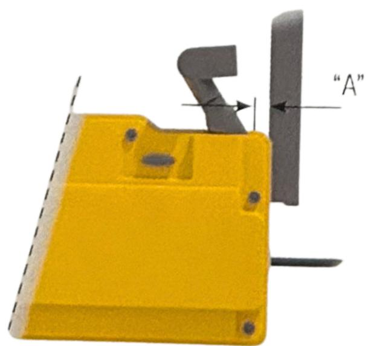  
Fig. 9.3

<table><tr><td rowspan=1 colspan=1>Modèle</td><td rowspan=1 colspan=1>Diamètrecâble e neuf</td><td rowspan=1 colspan=1>Dimension&quot;A&quot;(nedoit pasētre &lt; a)</td></tr><tr><td rowspan=1 colspan=1>T508</td><td rowspan=1 colspan=1>8.3 mm</td><td rowspan=1 colspan=1>37 mm</td></tr><tr><td rowspan=1 colspan=1>T516</td><td rowspan=1 colspan=1>11.55mm</td><td rowspan=1 colspan=1>37mm</td></tr><tr><td rowspan=1 colspan=1>T532</td><td rowspan=1 colspan=1>16.33mm</td><td rowspan=1 colspan=1>68 mm</td></tr></table>

# Comment utiliser le palan (modèles légers)9.8

Etape 1: Pour utiliser un palan léger, commencez par dérouler le câble Maxiflex pour Tirfor en ligne droite entre la machine et la charge, afin d'éviter la formation de boucles qui pourraient détordre les torons ou vriller le câble une fois tendu.

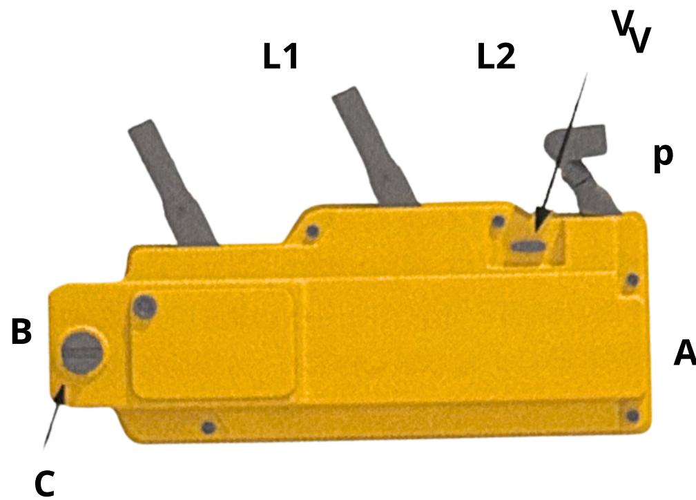  
Fig. 9.4

Etape 2: Ensuite, retirez la goupille de verrouillage et le goujon d'ancrage (C) du palan.

Etape 3: Pour insérer le câble, penchez le palan jusqu'à ce qu'il repose sur l'extrémité du goujon d'ancrage (B). Avec la main gauche, tournez le loquet de libération du câble (V) vers l'avant. Sur les modèles sans loquets de sécurité, insérez une pièce ou un tournevis dans la fente du point (V) et tournez vers l'avant. Avec la main droite, poussez fermement le levier de libération du câble (P) vers l'avant, en direction du goujon d'ancrage, jusqu'à ce qu'il soit bloqué en position.

Etape 4: Enfin, assurez-vous que les deux leviers de commande sont orientés dans le même sens. Insérez l'extrémité compactée en fuseau du câble Maxiflex dans le guide-câble (A) du côté opposé au goujon d'ancrage jusqu'à ce qu'il passe complètement à travers le palan.

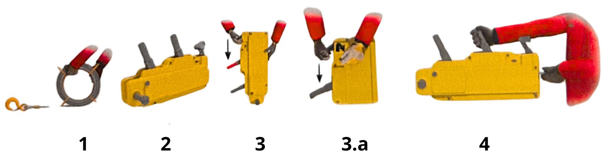  
Fig. 9.5

Étape 5: Passez le câble lâche à travers le palan (B) à la main.

Étape 6: Fixez l'élingue d'ancrage ou de suspension du palan et replacez le goujon d'ancrage en le passant à travers les anneaux de l'élingue. Remettez la goupille de verrouillage en place et assurez-vous que le câble Maxiflex passe sous le goujon d'ancrage.

Étape 7: Pour refermer le chemin de passage sur le câble, abaissez le levier de libération et laissez-le revenir à sa position initiale.

Étape 8: Montez la poignée télescopique sur le levier de manœuvre (L1), le plus proche du goujon d'ancrage, ou sur le levier de descente (L2), situé au centre du palan. Bloquez la poignée en la faisant pivoter. Le palan est maintenant prêt à être utilisé pour le levage ou la descente.

Étape 9: Tirez et poussez la poignée pour faire passer le câble dans le palan.

  
Fig. 9.6

Attention ! Ne tentez jamais d'actionner simultanément les leviers de levage et de descente, car la charge pourrait être instantanément relâchée. N'utilisez jamais de rallonge (tube) pour faire levier sur l'un des leviers de commande, car cela surchargerait le palan.

# Comment utiliser les modèles lourds

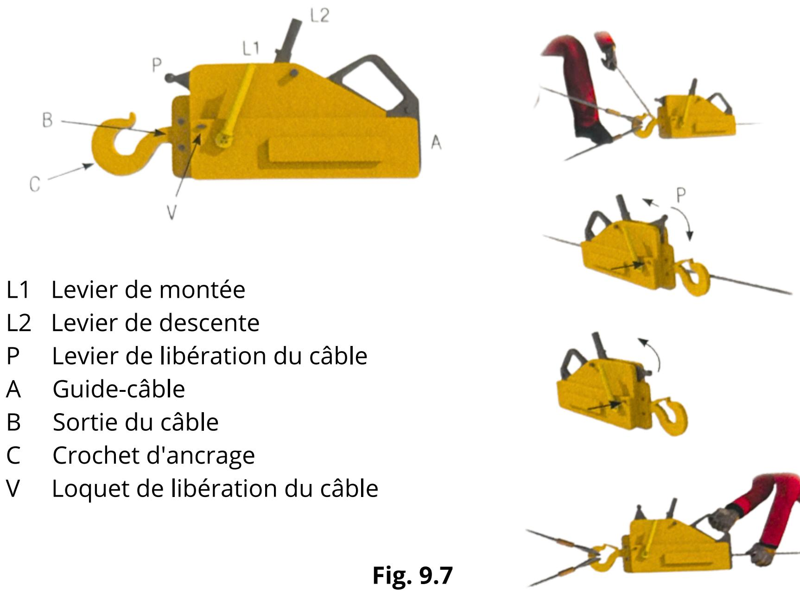

Étape 1: Déroulez le câble spécial Maxiflex pour Tirfor afin de former 9.9 une ligne droite, et ce afin d'éviter la formation de boucles qui pourraient détordre les torons ou vriller le câble une fois celui-ci

Étape 2: Les instructions suivantes supposent que le crochet d'ancrage du palan est orienté à l'opposé de l'opérateur.

Avec la main droite, appuyez sur le loquet de libération du câble (V) situé sur le côté du boîtier, à proximité du crochet, et maintenez-le enfoncé. Tirez sur le levier de libération du câble

(P) à l'aide de la main gauche afin de l'éloigner du crochet et jusqu'à ce qu'il soit en position verticale. Loquet de libération (V). Continuer de tirer sur le levier de libération du câble (P) jusqu'à ce qu'il soit bloqué en position. Les deux mâchoires sont maintenant ouvertes.

Étape 3: Après avoir posé le palan au sol, insérez l'extrémité compactée en fuseau du câble au point (A). C'est la meilleure position pour l'insertion du câble entre les mâchoires. Poussez le câble jusqu'à ce qu'il sorte au point (B).

Étape 4: Ancrez le palan et le crochet avec les élingues adaptées et assurez-vous que le loquet de sécurité est fermé.

Étape 5: Tirez le câble à la main jusqu'à ce qu'il soit tendu jusqu'à la charge.

Étape 6: Afin de refermer le chemin de passage sur le câble, tirez sur le levier de libération du câble (P) afin de l'éloigner du crochet, appuyez et maintenez enfoncé le loquet de libération du câble (V) situé sur le côté du palan. Laissez le levier de libération (P) revenir lentement à sa position de départ.

Étape 7: Le câble est maintenant fermement bloqué dans la mâchoire du palan. Pour utiliser le palan, placez le levier de manœuvre sur le levier de montée L1, bloquez-le en position en le faisant pivoter, puis tirez et poussez le premier levier. Le câble passe dans le palan à la fois lorsque l'on tire et pousse le levier.

# Ne jamais 9.10

Ne jamais utiliser un palan à câble comme élingage ou brin d'élingage lors de l'utilisation d'une grue pour un levage. Les palans à câble sont conçus pour être chargés de manière graduelle, en tendant le mou du câble grâce à l'action de « pression alternative » des mâchoires du palan. Ils ne sont pas conçus pour résister à des mises en charge brusques, comme celles qui peuvent se produire lorsque la charge est rapidement levée ou « arrachée » par une grue. Cela pourrait endommager les mâchoires ou, plus probablement, provoquer une panne catastrophique permettant au câble de glisser librement dans le palan.

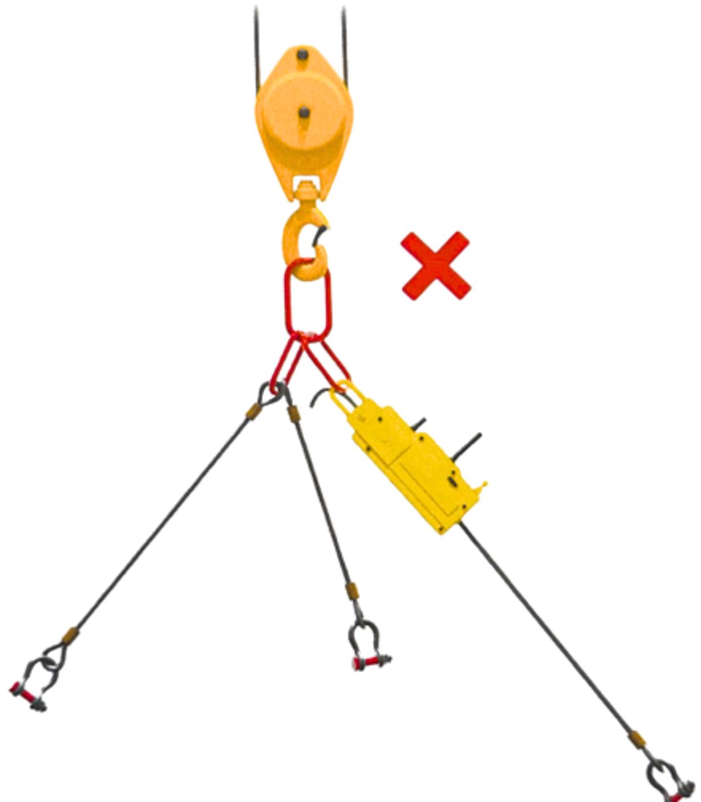  
Fig. 9.8

Attention ! Il est interdit de « déclasser » un palan à câble dans les circonstances décrites ci-dessus. Les fabricants n'acceptent généralement pas un tel usage abusif de leurs produits.

Pour permettre un ajustement final ou l'installation de la charge, vous pouvez installer un palan à câble en parallèle avec un brin d'élingage, en laissant un jeu de câble pour que le brin d'élingage supporte toutes les charges dynamiques. Une fois le mouvement vertical de la grue terminé et celle-ci pouvant servir de « chariot aérien automobile » (une structure fixe à laquelle le palan à câble peut être suspendu), le palan à câble peut alors supporter la tension de l'élingage, qui peut ensuite être déconnecté. Le palan à câble peut alors être utilisé pour effectuer l'ajustement final nécessaire.

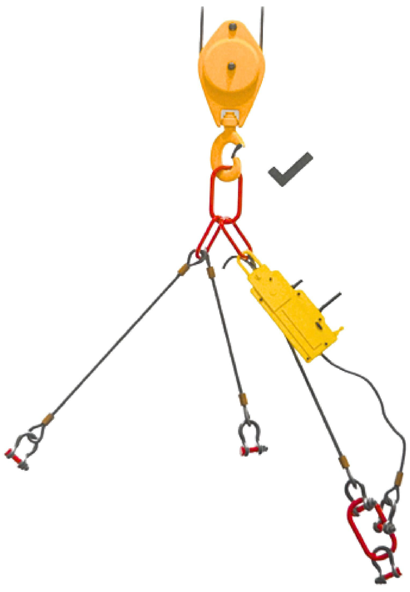

# UTILISATION SECURITAIRES DES POULIES A CHAPE OUVERTE /10.0 MOUFLES

Les moufles sont disponibles sous forme simple ou multiple avec un10.1 choix d’accessoires de suspension, les plus utilisées étant les émerillons simples ou émerillons à oeil ovale.

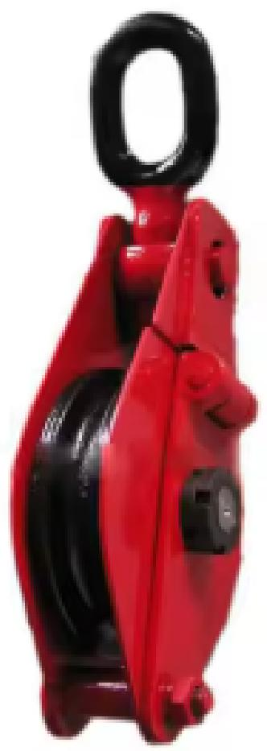  
Fig. 10.1

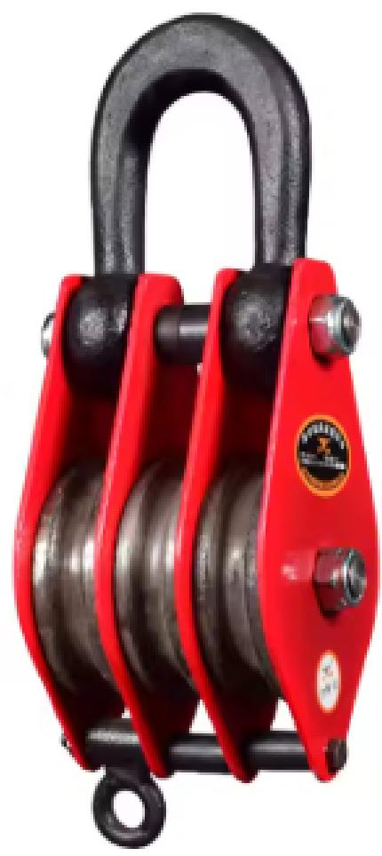

Le principal fonction d’une moufle simple est de changer le sens de10.2 levage ou de traction d’une corde, tandis que les moufles multiples réduisent l’effort de traction requis sur le brin d’attaque pour soulever la charge.

# Sélection10.3

La première chose à considérée lors de la sélection de moufles simples est la charge à soulever et la charge résultante sur l’élément de suspension (crochet), c’est à dire, charge plus traction de levage (qui sera plus élevée que la charge en raison des frottements sur les poulies). La charge résultante augmente lorsque l’angle entre les brins diminue.

Remarque: lorsque la moufle est du type à chape ouverte, elle doit être conçue de sorte que le boulon fixant la joue ne puisse être complètement sorti.

# Traction angulaire 10.4

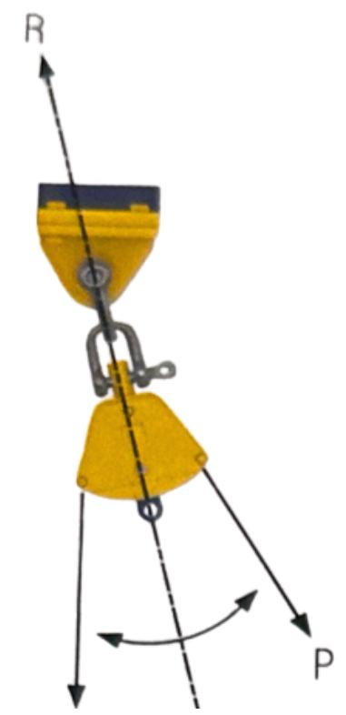

<table><tr><td rowspan=1 colspan=2>Angle°         Facteur</td><td rowspan=1 colspan=2></td><td rowspan=1 colspan=1>Angle°</td><td rowspan=1 colspan=1>Facteur</td></tr><tr><td rowspan=1 colspan=2>0                 2.00</td><td rowspan=1 colspan=2></td><td rowspan=1 colspan=1>100</td><td rowspan=1 colspan=1>1.29</td></tr><tr><td rowspan=1 colspan=1>10</td><td rowspan=1 colspan=1>1.99</td><td rowspan=1 colspan=2></td><td rowspan=1 colspan=1></td><td rowspan=1 colspan=1>110</td></tr><tr><td rowspan=1 colspan=1>20</td><td rowspan=1 colspan=1>1.97</td><td rowspan=1 colspan=2></td><td rowspan=1 colspan=1>120</td><td rowspan=1 colspan=1>1.00</td></tr><tr><td rowspan=1 colspan=1>30</td><td rowspan=1 colspan=1>1.93</td><td rowspan=1 colspan=2></td><td rowspan=1 colspan=1>130</td><td rowspan=1 colspan=1>0.84</td></tr><tr><td rowspan=1 colspan=1>40</td><td rowspan=1 colspan=1>1.87</td><td rowspan=1 colspan=2></td><td rowspan=1 colspan=1>135</td><td rowspan=1 colspan=1>0.76</td></tr><tr><td rowspan=1 colspan=1>50</td><td rowspan=1 colspan=1>1.81</td><td rowspan=1 colspan=2></td><td rowspan=1 colspan=1>140</td><td rowspan=1 colspan=1>0.68</td></tr><tr><td rowspan=1 colspan=1>60</td><td rowspan=1 colspan=1>1.73</td><td rowspan=1 colspan=2></td><td rowspan=1 colspan=1>150</td><td rowspan=1 colspan=1>0.52</td></tr><tr><td rowspan=1 colspan=1>70</td><td rowspan=1 colspan=1>1.64</td><td rowspan=1 colspan=2></td><td rowspan=1 colspan=1>160</td><td rowspan=1 colspan=1>0.35</td></tr><tr><td rowspan=1 colspan=1>80</td><td rowspan=1 colspan=1>1.53</td><td rowspan=1 colspan=2></td><td rowspan=1 colspan=1>170</td><td rowspan=1 colspan=1>0.17</td></tr><tr><td rowspan=1 colspan=1>90</td><td rowspan=1 colspan=1>1.41     」</td><td rowspan=1 colspan=2></td><td rowspan=1 colspan=1>180</td><td rowspan=1 colspan=1>0.00</td></tr></table>

${ \sf R } =$ Résultante (charge au sommet) $\boldsymbol { \mathsf { W } } = \mathsf { P o i d s } \dot { \boldsymbol { \mathsf { a } } }$ soulever $\mathsf { P } =$ Traction $( \mathsf { W } + \%$ pour frottement)

Remarque: il est généralement convenu que le pourcentage à ajouter pour les frottements est égal à:

Poulie à roulement à rouleaux: $4 \%$ par poulie, W x 1,04   
Poulies à roulements à bagues bronze: $8 \%$ par poulie, W x 1,08

Pour calculer la charge résultante R, commencez par déterminer la traction requise P en multipliant la charge à soulever W par 1,04 (poulies à roulements) ou par 1,08 (poulies à bagues), puis en multipliant par les facteurs indiqués dans le tableau de la fig 10.2 en fonction de l’angle entre les brins.

Attention ! Lorsque vous utilisez une moufle simple sur la partie supérieur, la charge résultante sur le support auquel celle-ci est fixée peut être le double de la charge soulevée, soit dans des conditions extrêmes.

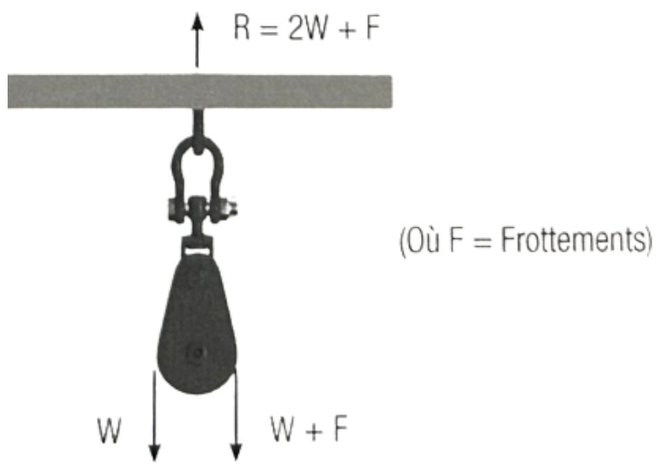  
Fig. 10.3

10.5 Lors de la sélection de moufles multiples, il est essentiel de prendre en compte la charge à soulever (W) ainsi que la traction de levage (P). La capacité du treuil détermine le nombre de moufles nécessaires (c'est-à- dire le nombre de brins) pour effectuer le levage, ainsi que la charge correspondante.

Le tableau ci-dessous vous aidera dans cette sélection.

Multipliez la charge à soulever (W) par les facteurs indiqués pour obtenir la charge résultante sur le crochet (R) et la charge de levage (P) requise.

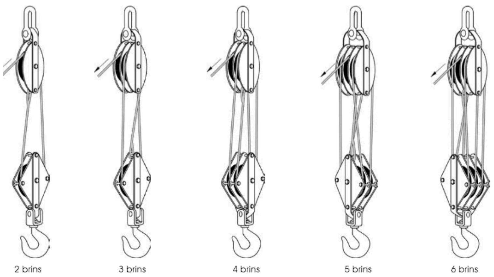  
Fig. 10.4

<table><tr><td rowspan=1 colspan=1>Nombrede brins</td><td rowspan=1 colspan=1>Réas avecbague bronze</td><td rowspan=1 colspan=1>Réas aveoroulementà billes</td></tr><tr><td rowspan=1 colspan=1>1</td><td rowspan=1 colspan=1>0.96</td><td rowspan=1 colspan=1>0.98</td></tr><tr><td rowspan=1 colspan=1>2</td><td rowspan=1 colspan=1>1.87</td><td rowspan=1 colspan=1>1.98</td></tr><tr><td rowspan=1 colspan=1>3</td><td rowspan=1 colspan=1>2.75</td><td rowspan=1 colspan=1>2.88</td></tr><tr><td rowspan=1 colspan=1>4</td><td rowspan=1 colspan=1>3.59</td><td rowspan=1 colspan=1>3.81</td></tr><tr><td rowspan=1 colspan=1>5</td><td rowspan=1 colspan=1>4.39</td><td rowspan=1 colspan=1>4.71</td></tr><tr><td rowspan=1 colspan=1></td><td rowspan=1 colspan=1>5.16</td><td rowspan=1 colspan=1>5.60</td></tr><tr><td rowspan=1 colspan=1>7</td><td rowspan=1 colspan=1>5.90</td><td rowspan=1 colspan=1>6.47</td></tr><tr><td rowspan=1 colspan=1>8</td><td rowspan=1 colspan=1>6.60</td><td rowspan=1 colspan=1>7.32</td></tr><tr><td rowspan=1 colspan=1></td><td rowspan=1 colspan=1>7.27</td><td rowspan=1 colspan=1>8.16</td></tr><tr><td rowspan=1 colspan=1>10</td><td rowspan=1 colspan=1>7.91</td><td rowspan=1 colspan=1>8.98</td></tr><tr><td rowspan=1 colspan=1>11</td><td rowspan=1 colspan=1>8.52</td><td rowspan=1 colspan=1>9.79</td></tr><tr><td rowspan=1 colspan=1>12</td><td rowspan=1 colspan=1>9.11</td><td rowspan=1 colspan=1>10.6</td></tr></table>

Exemple :   
$W = 1 6$ tonnes   
$\mathsf { P } = 3$ tonnes   
Combien de brins sont nécessaires ?   
$\mathsf { R } = \mathsf { W } / \mathsf { P } = 1 6 / 3 = 5 . 3$

Inversement, divisez la charge de levage ou la capacité du treuil (P) par le poids à soulever (W) et comparez le facteur obtenu dans le tableau pour déterminer le type de moufle et la CMU/CU requise.

# Vérifications avant l'utilisation 10.6

Avant d'utiliser une moufle, assurez-vous de vérifier les points suivants : La CMU/CU est adéquate pour la charge.

Le code couleur est à jour et la moufle porte un numéro d'installation ou une marque d'identification.   
La moufle ne présente pas de traces d'usure, de fissures ou de déformations dans la gorge.   
Soulevez la moufle pour vérifier l'usure des roulements et des bagues.   
Faites tourner les réas pour vous assurer que les roulements et les bagues tournent librement.   
Vérifiez que tous les trous de graissage sont propres et non bloqués, et que la moufle est bien graissée.   
Assurez-vous que les accessoires de crochet et d'émerillon ne présentent pas d'usure ou de déformation.   
Examinez les paliers de butée et leurs rondelles, si possible, pour vérifier leur bon fonctionnement.   
Vérifiez que l'axe supérieur et les sections filetées ne présentent pas d'usure ou de déformation.   
Si le crochet supérieur est du type à tige, vérifiez l'état de la tige et de l'écrou pour vous assurer qu'ils ne présentent pas d'usure ou de déformation. Vérifiez également que la traverse ne présente pas de traces d'usure.   
Assurez-vous que la manille et l'anneau de suspension ne présentent pas d'usure, de déformations ou de fissures.   
Vérifiez que les plaques et étriers latéraux ne présentent pas de traces d'usure, de déformation ou de fissures, en particulier autour du trou de l'axe chargé principal et du trou de suspension supérieur.   
Assurez-vous que les étriers et flasques latéraux ne présentent pas d'arêtes vives ou de barbures qui pourraient abîmer le câble.   
Vérifiez que les ringots, s'ils sont présents, ne sont pas usés, déformés ou fissurés.   
Vérifiez toutes les pièces d'écartement et les boulons d'assemblage pour vous assurer qu'ils ne sont pas déformés.   
À l'aide d'une jauge, vérifiez que le diamètre intérieur des réas est compatible avec le câble du treuil.

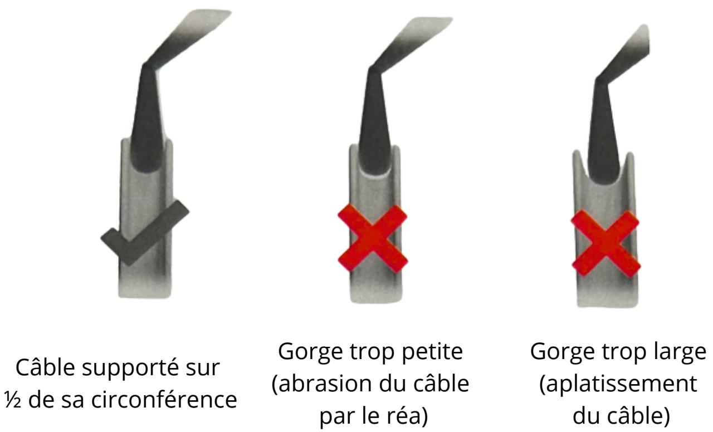  
Fig. 10.5

# 10.7 Sécurité

Avant de suspendre la moufle à la charpente de soutien, assurez-vous que toutes les goupilles fendues et d'arrêt sont correctement installées. Pour une moufle à chape ouverte, vérifiez que la goupille d'arrêt est bien en place.

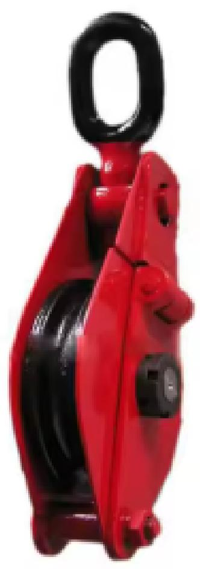  
Fig. 10.6

Assurez-vous que l'élément de charpente de suspension est assez solide 10.8 pour supporter toutes les charges prévues; en cas de doute, consultez votre superviseur.

Assurez-vous que la moufle est correctement alignée avec le brin10.9 d'attaque afin d'éviter que le câble ne frotte contre une joue.

Si le câble n'est pas manchonné, après mouflage:10.10

# Vous devez toujours vous assurer que

L'extrémité du câble est une attache à coin ouverte

# Ne jamais

Former l'extrémité du câble à l'aide de serre-câbles, leur utilisation étant formellement interdite dans les applications de levage. Surcharger la moufle.

Les treuils peuvent être manuels ou motorisés, les plus courants 11.1 sont les modèles pneumatiques.

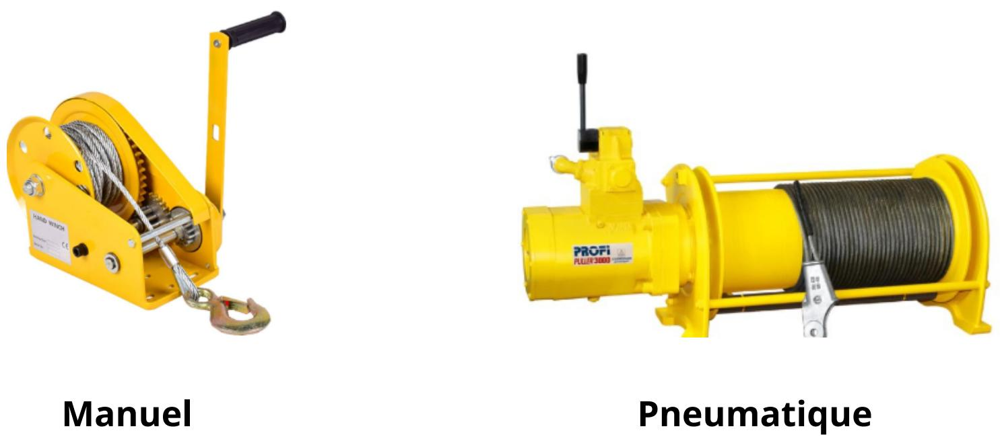  
Fig. 11.1

# Sélection 11.2

Lors de la sélection d’un treuil, l’élément le plus important est la traction requise. Si vous utilisez un mouflage multiple, consultez 11.4 de cette norme qui vous aideras pour les calculs. Ne pas oubliez que la majorité des chiffres indiqués sont basés sur les performances avec tambour à demi plein (la traction diminue quand le tambour se remplit).

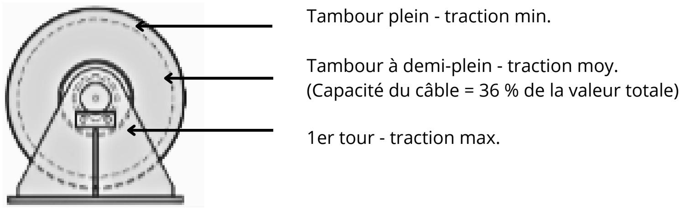  
Fig. 11.2

Remarque: la traction avec tambour à demi plein n’a qu’une performance moyenne. Ne pas ce chiffre avec la capacité du câble, qui est d’environ $3 6 \%$ du stockage tambour plein à ce point.

La capacité du tambour, c'est-à-dire la longueur de câble nécessaire, est11.3 illustrée à la figure 14.3.

Attention ! Le câble doit avoir une longueur minimale telle qu'en position extrême (les moufles supérieure et inférieure étant les plus éloignées possible), il reste au moins cinq couches sur le tambour. Cela permet d'éviter tout transfert de charge sur l'ancrage au tambour, qui n'est PAS un composant porteur.

Pour déterminer la longueur de câble requise, voici un exemple des paramètres à considérer : des moufles à 3 et à 2 réas, une moufle ouverte à corde et un treuil.

Multipliez la distance entre les centres des moufles par le nombre de brins. p. ex. $3 5 ~ { \mathsf { m } } \times { \mathsf { 5 } } = 1 7 5 ~ { \mathsf { m } }$

Ajoutez la longueur de corde de la moufle supérieure à travers la moufle ouverte jusqu'au treuil. p. ex. $3 0 \mathsf { m } + 1 0 \mathsf { m } = 4 0 \mathsf { m }$

Ajoutez la longueur autour des réas, c.-a-d., nombre de réas x 0,5 fois la circonférence du réa. p. ex. $5 \times 6 0 0 ~ \mathrm { m m } = 3 ~ \mathrm { m }$

Ajoutez la marge de 5 tours sur le tambour, soit 5 fois la circonférence de celui-ci. p. ex. $5 \times 2 . 5 ~ \mathsf { m } = 1 2 . 5 ~ \mathsf { m }$

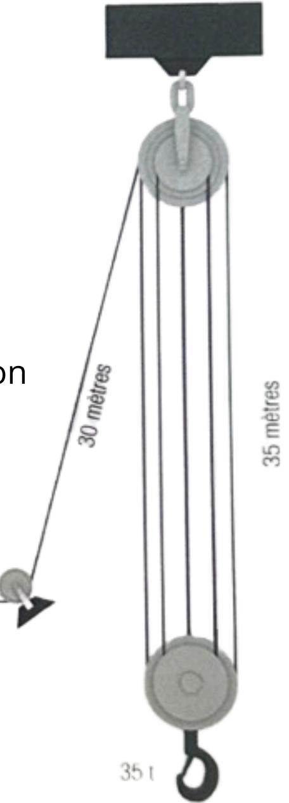

Longueur totale du câble requise. $= 1 7 5 \mathsf { m } + 4 0 \mathsf { m } + 3 \mathsf { m } + 1 2 , 5 \mathsf { m } = 2 3 0 , 5 \mathsf { m }$ (Lorsque cette longueur représente plus de $3 6 \%$ de la capacité du tambour, vérifiez à nouveau la traction donnée pour le treuil dans le catalogue du fabricant).

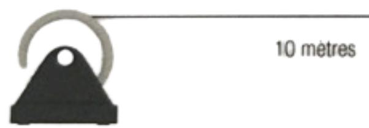  
Fig. 11.3

# Vérifications avant l'utilisation 11.4

Avant d'actionner le treuil, vérifiez que:

La CMU/CU est adéquate pour la charge.

Le code couleur est à jour et le treuil porte un ${ \mathsf { n } } ^ { \circ }$ d'installation / une marque d'identification.

La garde de câble n'est pas endommagée ni tordue, ce qui pourrait bloquer et/ou user le câble En l'absence de garde, NE PAS

# UTILISER !

Le tambour du treuil n'est pas usé, déformé ou fissuré.

Les bandes et tambours de frein ne sont pas anormalement usés.

Les bandes et tambours sont propres et ne présentent pas de rouille ou autre contamination.

Lorsqu'ils sont présents, examinez le frein automatique et les ressorts d'arrêt, leurs bielles et goupilles.

Vérifiez que la partie exposée de la tige de piston ne présente pas de rouille et autre corrosion.

Une fois le courant coupé, vérifiez que tous les leviers de commande reviennent en position neutre quand on les relâche.

Vérifiez que les flèches et marques de sens de défilement sont en place et clairement visibles.

Vérifiez le niveau d'hulle.

Examinez le socle du treuil et vérifiez qu'il ne présente pas de soudures fissurées, fissures autour des trous de boulons, déformations ou autres dégâts dus à des chocs.

# Ancrage:

Vérifiez que les boulons, soudures et autres fixations sont adéquats et autant que possible, que les éléments du socle métallique ne présentent pas de signes de détérioration.

Remarque: si un treuil est déplacé, il doit être rééprouvé, à moins que le nouvel ancrage ait déjà été certifié.

vérifiez que l'alimentation en air convient pour ce type particulier de treuil (pression, etc.). Branchez l'alimentation en air et faites un essai de fonctionnement du treuil.

Inspectez visuellement le câble du treuil et vérifiez qu'il ne présente pas:11.5

D'usure et de rouille et autre corrosion.   
● De traces d'abrasion.   
De dégâts mécaniques (écrasements, fils brisés...).

# Commande et pose du câble 11.6

Si un nouveau câble est nécessaire , assurez-vous que vous mesurez correctement le diamètre pour éviter d'avoir un câble TROP PETIT.

  
Mesure correcte avec pied à coulisse

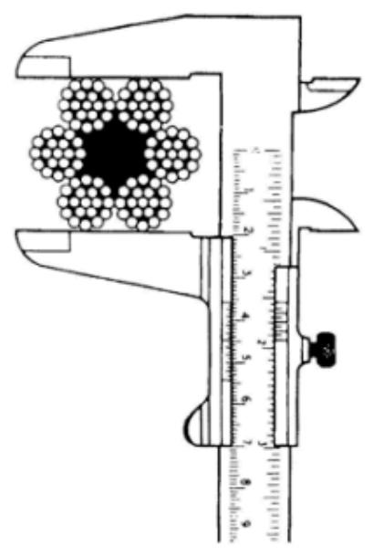  
Fig. 11.4   
Mesure incorrecte

Lorsque vous déroulerez un câble d’un touret en bois sur le tambour du 11.7 treuil, évitez de la courber dans l’autre sens, ce qui abîme le commettage.

11.8 Il est essentiel de déterminer le commettage approprié du câble. Lorsqu'un câble ou cordage avec le sens de commettage correct est enroulé, les boucles sur le tambour se loveront les unes contre les autres et maintiendront une nappe régulière lorsque la charge sera déposée. En revanche, avec un câble ou cordage au commettage incorrect, les boucles se séparent lorsque la charge est déposée. Lors de la reprise de l'enroulement, les boucles de câble peuvent se croiser et se chevaucher, entraînant un aplatissement et un écrasement.

Cable croisé à droite Enroulement de la gauche vers la droite

Cable croisé à droite Enroulement de la droite vers la gauche

  
Fig. 11.5

Commettage à gauche - main gauche Commettage à droite - main droite

  
Fig. 11.6

11.9 Les treuils les plus utilisées ont un étrier de frein long et un étrier de frein court

Assurez-vous que l'enroulement du câble est correct par rapport aux étriers, car un bobinage incorrect peut :

Réduire l'efficacité des freins.   
Diminuer considérablement la capacité de treuillage, car la vanne rotative fonctionnera en sens inverse.

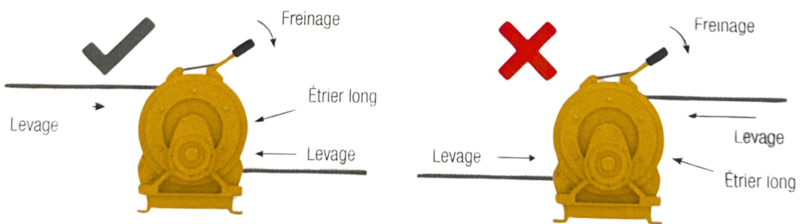  
Fig. 11.7

Remarque: toute modification du sens d’enroulement doit faire l’objet d’une discussion avec le fabricant et être approuvée par celui-ci.

# Angle de déflexion11.10

Nous recommandons que l'angle de déflexion maximal pour un tambour lisse ne dépasse pas $1 , 5 ^ { \circ }$ . Pour un tambour rainuré, cet angle peut aller jusqu'à $2 , 5 ^ { \circ }$ . Pour atteindre ces valeurs, il peut être nécessaire d'utiliser une poulie ou une moufle déflectrice.

Dans la majorité des cas, le câble a une cosse fixée par virole, mais dans 11.11 certaines circonstances (mouflage multiple) la cosse est enlevée et l'élément de terminaison doit être monté sur place. La meilleure solution consiste à utiliser des attaches à coin ouvertes, en particulier pour le levage de charges.

Remarque 1: les attaches à coin ouvertes ont une efficacité de $80 \%$ . On vérifiera visuellement qu'elles ne présentent pas de fissures autour de la chape.

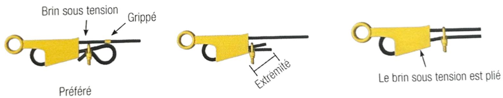  
Fig. 11.8

Ne pas serrer le brin mort contre le brin sous tension (mauvaise technique courante).

Remarque 2: des attaches à coin étendu sont maintenant disponibles et intègrent un trou permettant le montage du serre-câble. La sécurité est ainsi plus grande et l'extrémité est plus propre.

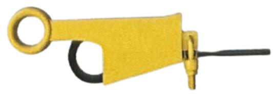  
Fig. 11.9

Remarque 3 : Le brin mort (retourné) doit avoir une longueur minimale de 6 diamètres pour les câbles standard et de 20 diamètres pour les câbles antigiratoires, mais dans tous les cas, il ne doit pas être inférieur à 150 mm.

La cosse fixée par virole peut être équipée d'un crochet ou d'une manille pour la connexion à la charge. La plupart des fabricants privilégient l'utilisation d'un crochet de sécurité de type fermé (par exemple, BK) ou d'une manille de sécurité. Ces dernières semblent être l'attache préférée lorsqu'on utilise le treuil pour le levage de personnes.

Il existe différents types de serre-câbles permettant de terminer les 11.12 câbles sur place ; les trois types les plus courants sont :

“First Grips” (efficacité: $8 0 \%$ )   
Serre-câbles “Eureka” (efficacité variable, en moyenne $45 \%$ sur la basse d’essais indépendants effectués sur des serre-câbles de 16 mm à 2 boulons)   
Serre câbles “Bulldog” (seul le type DIN1142 est acceptable efficacité $8 0 \% )$ (d)

Les chiffres d’efficacité indiqués ci-dessus sont basés sur la charge de rupture du câble indiquée par le fabricant.

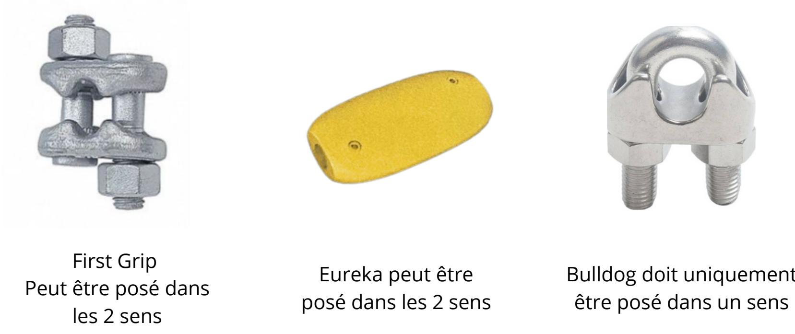  
Fig. 11.10

Remarque: dans les situations générales d’élingage, l’utilisation de tout type de serre câble à l’extrémité des câbles dans des applications de levage ou de traction est interdite.

# Utilisation des treuils11.13 Toujours

Garder les mains éloignées du câble/cordage s’enroulant sur le tambour.   
Tenir le personnel éloigné du câble de levage.   
Vérifier que le frein fonctionne correctement avant de lever une charge à une hauteur importante.   
Abaisser la charge lentement pour éviter les charges dynamiques sur le treuil et le câble.

# Ne jamais 11.14

Surcharger le treuil   
L’utiliser pour lever ou descendre du personnel, sauf s’il a été spécifiquement conçu à cette fin et possède le marquage afférent.   
Changer de sens d’enroulement/déroulement (bobinage) sans consulter auparavant le fabricant.

Remarque: lorsqu’ils y a plusieurs treuils dans un espace restreint, il est nécessaire pour des raisons de sécurité de marquer les terminaisons des câbles avec l’identité du treuil correspondant.

Attention ! Lorsque l’on opère un treuil avec le câble passant dans une moufle en hauteur, il est souvent nécessaire de fixer un poids à son extrémité pour empêcher qu’il ne se déroule intempestivement sous l’effet du poids du segment situé entre la moufle et le treuil. Cela est particulièrement important dans le cas d’un transfert

# Treuils de transfert (levage) de personnel11.15

Sur les derricks et les plates-formes de forage, les treuils sont fréquemment utilisés pour le transfert de personnel. Ces treuils doivent être soit spécialement conçus à cet effet, soit modifiés et recertifiés pour cette utilisation. Dans tous les cas, ils doivent porter la mention "apte au transfert de personnes". Aucun autre type de treuil ne peut être utilisé pour le transfert de personnel.

Attention ! Lors de telles opérations, ne JAMAIS laisser le treuil sans surveillance, quelles que soient les circonstances

# 12.0 UTILISATION SECURITAIRE DES ELINGUES CABLES

12.1  Les élingues en câbles métalliques sont souvent fabriquées avec ces terminaisons formées par épissure mécanique couramment appelées viroles, gaines ou manchons. Le œil de l’élingue peut être muni ou non de cosses en fonction de l’application.

# 12.2  Sélection

Les élingues à câbles sont les plus utilisées car elles sont très polyvalentes et relativement légères par rapport à leur résistance. Elles peuvent être simples (monobrin) ou à brins multiples.

# Elingues simples et sans fin

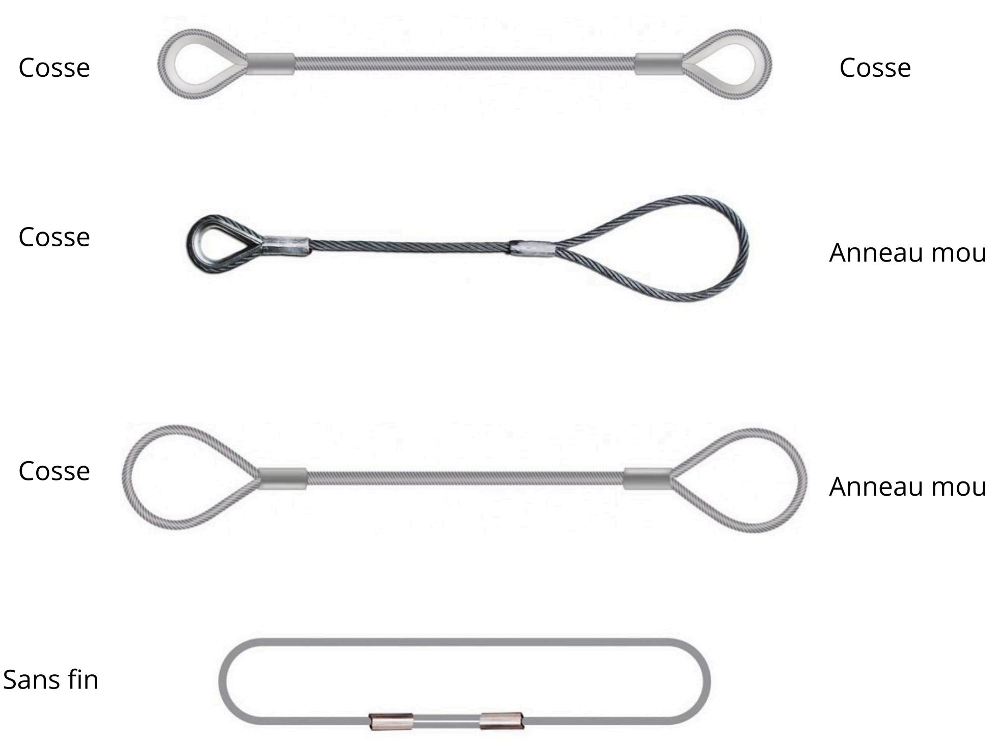  
Fig. 12.1

Elingues multi-brins

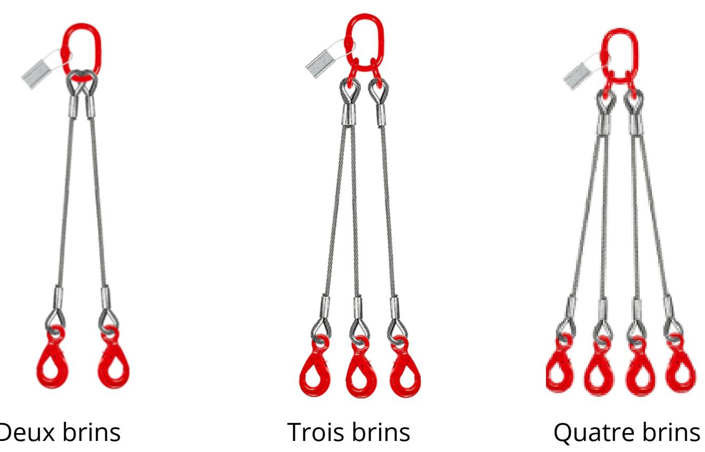  
Fig. 12.2

La majorité des élingues utilisées doivent être munies de cosses pour 12.3 utiliser au mieux la résistance du câble, car avec des élingues à boucle souple, la résistance est moindre si l’oeil supportant la charge a un faible diamètre.

# 12.4 Charges maximale d’utilisation

La CMU est fixé en fonction :

1. Du diamètre.   
2. De la construction (type d’âme).   
3. De la résistance à la traction du fil métallique.

La construction du câble est choisie en fonction d’une application spécifique, les câbles métalliques avec âme acier offre une meilleur résistance à l’écrasement et à l’aplatissement lors du treuillage par exemple. Tandis que ceux à âme acier et fibres conviennent pour la fabrications d’élingues.

A titre d’exemple la figure 12.3 définit la charge maximal d’une élingue à câble $( 6 \times 3 6 0 4 6 \times 1 9 )$

Attention ! Ce tableau est donnée à titre d’exemple et ne peux pas être utilisé pour une autre composition de câble. Dans ce tableau la charge d’utilisation maximal en tonnes est définie pour les différents modes d’élingage.

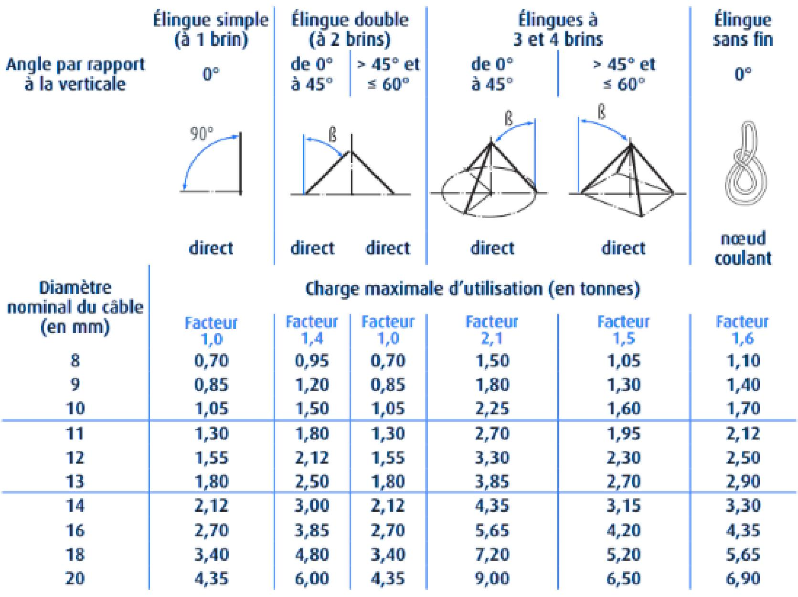  
Fig.12.3

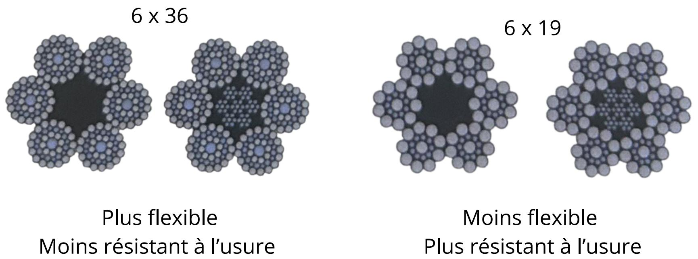  
Fig.12.4

# Avantage des élingue à câbles 12.6

A solidité égale, les élingues câble sont plus légères que des élingues à chaîne, elle risque de moins abimer les charges fragiles ou de surfaces délicates. Elles absorbent également mieux les charges dynamiques.

Lorsque l’élingue est munie de crochets le seul type autorisé est le type12.7 “fermé”.

  
Fig.12.5

# A faire et à ne pas faire

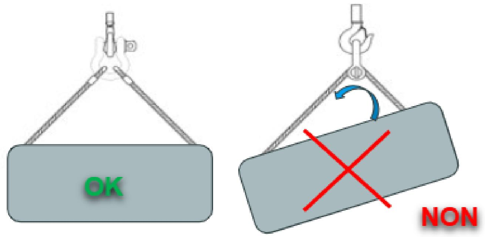

Ne jamais passer une élingue à travers un crochet ou une manille ! 91

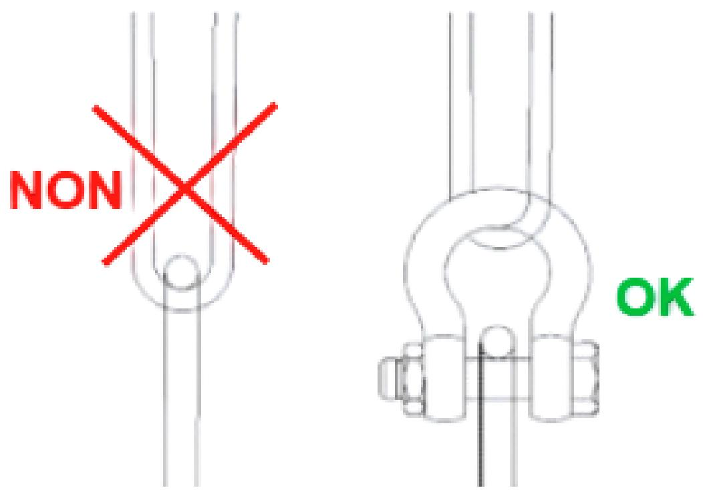

Toujours utiliser une manille pour connecter deux élingues

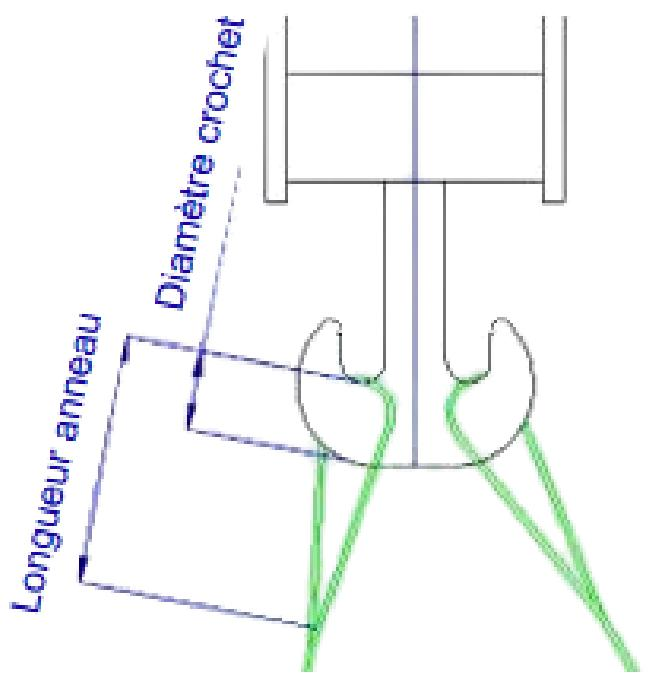

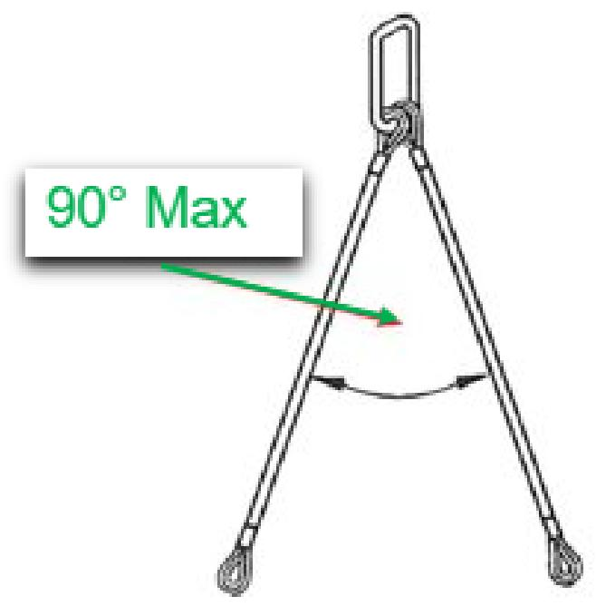

Assurer vous que la longuer de l’anneaux est $\geq 2 \times$ le diamètre du crochet

# Vérifications avant utilisation 12.8

Les vérifications suivantes doivent être effectuées avant d’utiliser une élingue :

La CMU est adéquate pour la charge   
Le code couleur est à jour et l’élingue porte un ${ \mathsf { n } } ^ { \circ }$ d’installation / une marque d’identification.   
Examinez chaque brin individuel sur toute sa longueur et vérifiez qu’il ne présente pas d’usure, de corrosion, d’abrasion ou de fils brisés.   
Examinez chaque virole ou manchon et vérifiez qu’il a la taille correcte.   
La virole/ manchon ne doit pas présenter de fissures ou déformations.   
Vérifiez que chaque cosse a été posée correctement.   
Examinez le câble autour des cosses, où il subit souvent une abrasion due au fait que l’élingue est traînée sur des surfaces rêches.   
Examinez l’anneau/ maillon de tête et l’assemblage quadruple et vérifiez l’absence d’usure, de corrosion et de fissures.   
Lorsque des crochets sont utilisés, vérifiez l’absence d’usure, de corrosion et de fissures et vérifiez que les linguets de sécurités fonctionnent.

Pour les élingues à plusieurs brins, la capacité maximale d'utilisation (CMU) indiquée reste valable tant que l’angle de levage ne dépasse pas $90 ^ { \circ }$ . Il est impératif de ne pas excéder cet angle, sauf si l’élingue a été spécifiquement conçue, testée et marquée pour supporter un angle supérieur.

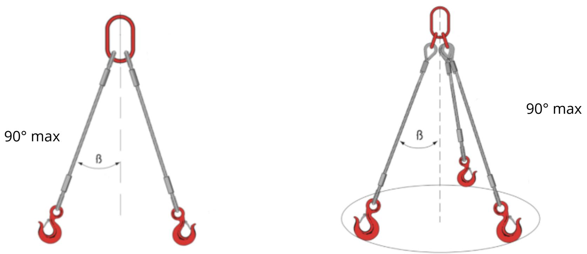  
Fig.12.6

Lors de l’utilisation d’élingues simples en paire ou d’élingues sans fin, il12.10 convient de prendre en compte les pertes de capacité liées à l’angle de levage et à la configuration géométrique.

# Tire-câbles, chaussettes et « Chinese Fingers »12.11

Les tire-câbles sont principalement destinés à la traction ou au maintien de câbles métalliques, de cordages ou de tubes. Fabriqués à la main à partir de fil d’acier galvanisé haute résistance, ils doivent être utilisés avec précaution.

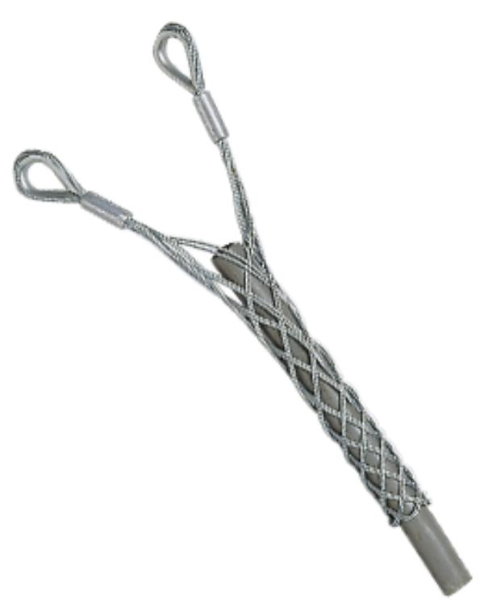  
Fig.12.7

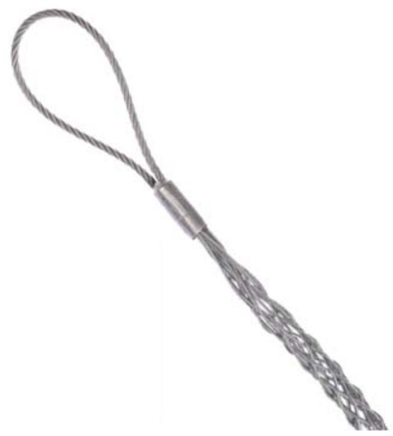

Tire-câbles standard un et deux yeux

Chaque modèle possède une charge de rupture définie. L’utilisateur doit12.12 appliquer un coefficient de sécurité adapté à l’usage prévu :

Pour les opérations de traction classiques : un facteur de sécurité de 3 est recommandé (capacité $=$ charge de rupture ÷ 3).

Pour les opérations de levage plus sensibles : un facteur de 5 est requis (capacité $=$ charge de rupture $\div 5$ ).

Ce facteur vise à prévenir la rupture du tire-câble sous l’effet de la charge, mais ne garantit pas l’adhérence sur le câble tracté ou soulevé, qui dépendra de son état et de sa préparation.

Attention ! Certains fabricants déconseillent l’usage de leurs tire-câbles pour le levage. Il est donc essentiel de consulter leur documentation technique.

# Tire-câbles pour traction12.13

Utilisés pour tirer des câbles, tubes ou cordages, notamment lors de l’installation sur des grues ou des poulies. Les diamètres standards vont de 4 à 115 mm, avec des variantes adaptées à la charge. Des modèles sur mesure peuvent être fabriqués pour des diamètres allant jusqu’à 600 mm ou plus.

On distingue deux types :

Tire-câbles de traction : pour des charges légères (tubes plastiques, cordages), un seul fil métallique peut suffire. Pour des charges lourdes, on utilise des tresses simples, doubles ou triples. Tire-câbles porteurs : similaires aux précédents, mais intégrés à l’installation. Ils peuvent comporter une ou deux boucles selon les points d’ancrage.

La longueur standard varie de 600 à 1 000 mm, mais des versions plus longues existent, notamment pour les tresses triples.

# Recommandations d’usage 12.14

Les tire-câbles à extrémité libre peuvent servir de manchon pour tirer un câble de remplacement, mais ne doivent pas être utilisés si un risque de rotation entre les câbles existe (ex. : câbles électriques). Dans ce cas, il est préférable d’utiliser deux tire-câbles reliés par un émerillon.

Éviter de superposer deux tire-câbles, car cela compromet leur efficacité et peut les endommager.

Pour faciliter l’installation de longues sections de câble, on peut ajouter des points de traction intermédiaires à l’aide de tire-câbles fixés à intervalles réguliers.

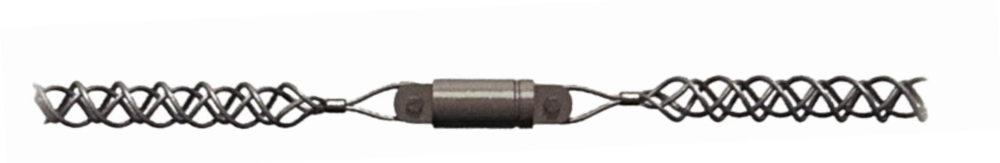  
Fig.12.8

# 12.15  Inspectez visuellement le tire-câble avant l'emploi.

Si vous l'installez sur un câble métallique, assurez-vous que l'excédent de lubrifiant a été enlevé.

Sélectionnez la taille correcte de tire-câble pour le diamètre de l'objet à tirer.

Sélectionnez le tressage correct requis (simple, double ou triple).

# 12.16  Instructions générales pour la pose de tire-câbles

Pour faciliter les choses, l'extrémité libre du tire-câble peut être pressée contre une surface plate afin d'évaser les extrémités des fils de la tresse, ce qui facilitera le montage de cette extrémité sur le câble, etc.

Enfoncez le tire-câble le long du câble, en poussant de l'extrémité à boucle vers l'extrémité libre, ce qui provoque la légère expansion de la gaine nécessaire pour la faire passer sur le câble.

Les tire-câbles à une boucle doivent être tirés au maximum sur le câble de façon à ce que celui-ci les traverse de part et d'autre. Avec les modèles à deux boucles, le câble peut être enfoncé dans le tire-câble passant entre les deux boucles, aussi loin que nécessaire.

Assurez-vous que le tire-câble repose uniformément et fermement contre le câble en plaçant les deux mains autour de la circonférence du câble.

Pour les modèles à une seule boucle, commencez par l'extrémité bouclée.

Pour les modèles à deux boucles, commencez à l'extrémité libre, sans boucles.

Serrez au maximum sur la gaine et déplacez-vous vers l'autre extrémité du tire-câble en glissant fermement les mains sur la gaine tressée afin qu'elle soit bien serrée contre le câble.

Pour encore augmenter le serrage, vous devez poser un collier autour du tire-câble à l'extrémité ouverte (du côté opposé aux boucles). Appliquez la traction lentement pour permettre au tirecâble de se contracter et de serrer.

Traction sur l’extrémité à boucles

Collier

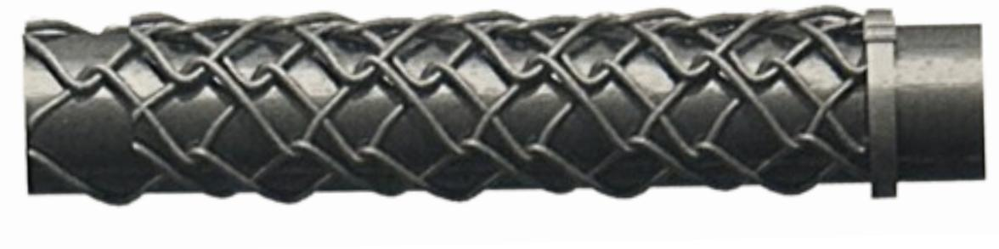  
Fig.12.9

# Ne jamais

Surcharger ou exercer une traction forte et brutale sur un tire-câble. Utiliser un tire -câble s’il présente un quelconque signe d’avarie ou d’usure (ce que vous vérifiez avant chaque utilisation).

Attention ! Si à un moment quelconque un des fils de la nappe tressé venait à se casser, arrêtez immédiatement de tier. De telles cassures sont généralement causées par une surcharge ou une application inégale de la force de traction.

Lors de l’utilisation de ces tire-câbles, portez un équipements protecteur (gants) en permanance.

Il est essentiel de surveiller rigoureusement les conditions de stockage et de manipulation des élingues en fibres synthétiques afin de préserver leur intégrité et d’éviter toute contamination. En raison de leur conception, ces élingues peuvent perdre une grande partie de leur résistance en cas de coupure, de déchirure, d’effilochage ou de rupture des coutures.

Si la gaine de protection présente des dommages ou des entailles, l’élingue doit être immédiatement mise hors service. De manière générale, les élingues en fibres synthétiques et les sangles doivent être retirées du service après un an d’utilisation, sauf dans le cas d’applications spécifiques. Pour ces dernières, une inspection rigoureuse est nécessaire pour prolonger leur usage au-delà de cette période.

En raison de la sensibilité du matériau, la capacité maximale d’utilisation (CMU) peut être fortement réduite en cas de défauts visibles. Il est donc impératif de procéder à un examen minutieux avant chaque utilisation et de ne pas réutiliser une élingue présentant l’un des défauts mentionnés.

Les élingues en fibres synthétiques (plates et rondes) sont 13.1 disponibles en cinq types de base:

# Format

# Applications

A boucles cousues Avec maillons en D Avec maillons en D et maillon mouflage Sans fin (plate - sangle) Sans fin (ronde)

Multiples   
Simple direct ou brassière   
Simple direct, brassière/ maillon   
mouflage nœud coulant   
Multiples   
Multiples

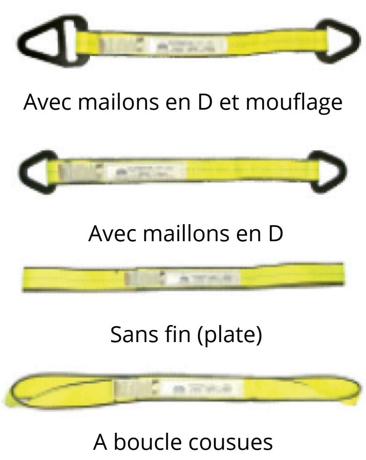  
Fig.13.1

# Capacité de levage et choix du type d’élingue 13.2

La largeur de l’élingue influence directement sa capacité de levage :

Une élingue simple (épaisseur simple) offre environ 1 tonne de capacité par 50 mm de largeur.

Une élingue double (double épaisseur) offre environ 1 tonne par 25 mm de largeur.

Le choix entre une élingue plate ou ronde dépend du mode d’élingage 13.3 prévu, car celui-ci impacte la CMU. Il convient donc d’appliquer un facteur de mode (M) adapté à la configuration d’utilisation.

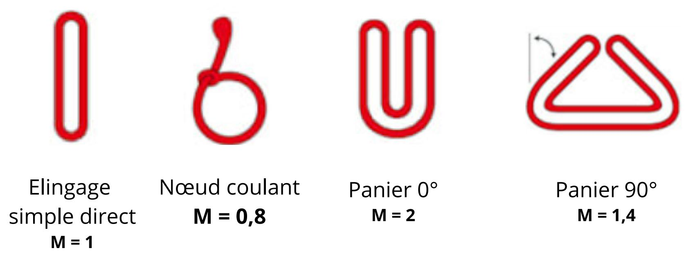  
Fig.13.2

Pour les opérations courantes, les élingues rondes ou estropes à 13.4 boucles souples sont recommandées pour leur polyvalence. Toutefois, en cas d’usage fréquent, les modèles avec maillons en D sont préférables en raison de leur meilleure résistance à l’usure.

Pour les charges fragiles ou aux formes complexes (comme les vannes,13.5 armoires de commande, actionneurs, etc.), les élingues rondes sont à privilégier. Leur souplesse et leur capacité à former un nœud coulant assurent un maintien sûr sans endommager la charge.

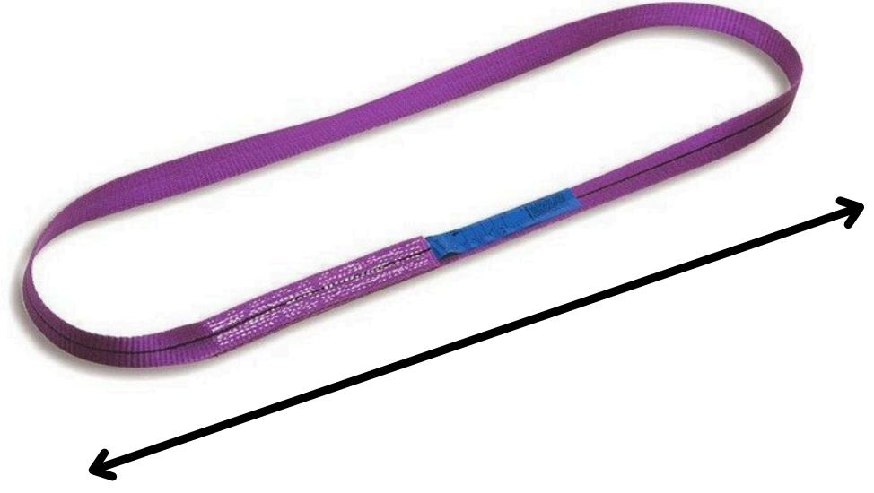  
Fig.13.3

Longuer utile efficace (entre points de charges)

# Vérifications avant utilisation13.6

Avant d’utiliser des élingues plates ou rondes, vous devez les examiner sur toute leur longueur pour vous assurer que :

La CMU/CU est adéquate pour la charge   
Le code couleur est à jour   
● L’élingue porte un ${ \mathsf { n } } ^ { \circ }$ d’installation   
Il n’y a pas de coupures, déchirures ou effilochages   
• De dégâts dus à des produits chimiques   
(d Ou à la chaleur   
De pénétration de corps étrangers dans les fibres   
De déformation/ d’usure des oeillets métalliques

Attention ! Lorsque de l’inspection délingues rondes et en cas de découverte de coupures dans la gaine protectrice, ces premières doivent être mises au rebut car la résistance de l’âme intérieur pourrait être compromise.

# 13.7 Consignes de sécurité

Les élingues en fibres synthétiques sont destinées à un usage sur site ou 13.8 sur installation, mais ne doivent pas être utilisées pour le transport entre ces lieux.

La majorité est fabriquée en polyester, ce qui leur confère une bonne13.9 résistance à l’eau de mer, aux hydrocarbures et à de nombreux acides à température ambiante. En revanche, elles sont vulnérables aux bases alcalines, qui peuvent dégrader le polyester.

Il est crucial d’éviter tout contact avec des arêtes vives, qui risqueraient13.10 de couper ou d’endommager l’élingue lors de la prise de charge. Des protections doivent systématiquement être mises en place autour de ces zones à risque.

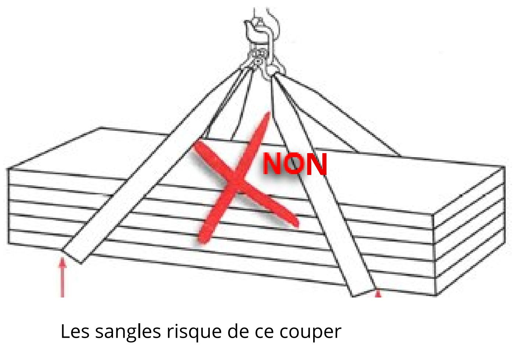  
Fig.13.4

Toujours placer des protections autour des arêtes vives.

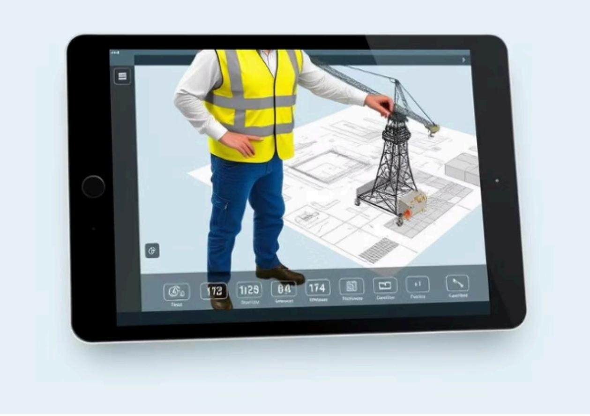